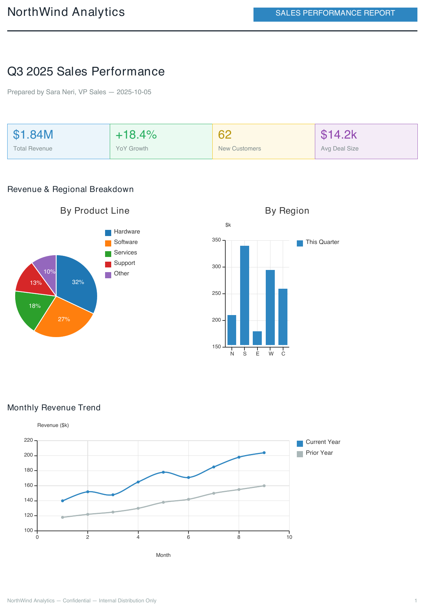

# Docraft
[](https://github.com/Cadons/Docraft/actions/workflows/build.yml)
[](https://github.com/Cadons/Docraft/actions/workflows/docs.yml)

Why Docraft?
------------

Generating PDF documents from C++ has always been a painful experience.
The ecosystem is fragmented: developers must either call low-level libraries
that expose raw page-drawing primitives (coordinates, fonts, streams) or
shell out to external tools like LaTeX, wkhtmltopdf, or headless browsers.

None of the existing solutions offer what modern C++ applications actually
need: **a library-level, declarative approach to PDF generation** that runs
entirely inside your process with no external dependencies.

Docraft solves this problem.

What is Docraft?
----------------

Docraft is a **C++ library** that lets you define documents using an
XML-based markup language called the **Craft Language**. You describe *what*
your document looks like — text, tables, images, shapes, headers, footers —
and Docraft takes care of *how* to lay it out and render it to PDF.

It ships as a static or shared library that you link into your CMake project.
The rendering pipeline runs entirely in-process using [libharu](https://github.com/libharu/libharu) as the PDF backend — no spawning of
external processes, no temporary files, no network calls.

---

<p align="center">
  
</p>

<p align="center"><sub>That entire dashboard is one &lt;Canvas&gt; with two &lt;Chart&gt; tags on it:</sub></p>

```xml
<Canvas width="495" height="230">
    <Chart x="0" y="0" style="pie" width="240" height="220" title="By Product Line">
        <Series model="${revenue_split}"/>
    </Chart>
    <Chart x="250" y="0" style="histogram" width="245" height="220" title="By Region">
        <Series name="This Quarter" color="#2E86C1" model="${regional_sales}"/>
    </Chart>
</Canvas>
```

<p align="center"><sub><a href="https://cadons.github.io/docraft/examples/sales_report.html">Full template &amp; data</a> — more document types (invoices, shipping labels, QC reports...) in the <a href="https://cadons.github.io/docraft/examples/index.html">example gallery</a>.</sub></p>

---

Key Features
------------

- **Declarative XML markup** — Define documents with the Craft Language
  instead of writing coordinate-level drawing code.
- **Automatic page layout** — Flow-based layout engine with automatic page
  breaking; no manual page management required.
- **Header / Body / Footer sections** — Define them once; Docraft repeats
  headers and footers on every page automatically.
- **Automatic page numbering** — Insert ``<PageNumber/>`` and the library
  fills in the correct number on each page.
- **Template engine** — Bind ``${variables}`` and iterate over JSON arrays
  with ``<Foreach>`` to generate data-driven documents at runtime.
- **Rich text styling** — Font family, size, bold, italic, underline,
  alignment (left, center, right, justified), and color.
- **External font support** — Register custom TTF fonts (regular, bold,
  italic, bold-italic variants) for full typographic control.
- **Shapes** — Rectangle, Circle/oval, Triangle, Line, Polygon with background
  color, border color, and border width, plus a free-form ``<Canvas>`` that
  positions them by coordinates instead of stacking them.
- **Tables** — Column titles, row/column weights, per-cell backgrounds, and
  JSON model binding for data-driven tables.
- **Ordered & unordered lists** — Number, roman numeral, dash, star, circle,
  and box markers.
- **Horizontal & vertical layouts** — Nest ``<Layout>`` elements with
  weights to build multi-column or multi-row compositions.
- **Image support** — PNG, JPEG from file, and raw RGB pixel data injected
  at runtime via the template engine (including base64 decoding).
- **Document metadata** — Author, title, subject, keywords, creation date,
  and automatic keyword extraction from document content.
- **Page format control** — A3, A4, A5, Letter, Legal in portrait or
  landscape orientation; configurable header/body/footer ratios.
- **Absolute positioning** — Place any element at exact (x, y) coordinates
  when flow layout is not appropriate.
- **Z-index stacking** — Control rendering order with ``z_index``.
- **DOM traversal & lookup** — Query the document tree by name or type after
  parsing, before rendering.
- **Charts and canvas** — Render bar, line, and pie charts with data binding; draw arbitrary
  shapes and paths on a canvas.
- **Pluggable backend** — The rendering backend is abstracted behind
  interfaces; swap or extend it without changing the document model.
- **CLI tool** — The ``docraft_tool`` executable renders ``.craft`` files
  to PDF from the command line, with optional JSON / key-value data files.

---

## License

Docraft is licensed under the **Apache License 2.0**.
See the full text in [`LICENSE`](LICENSE).

For contribution workflow, coding style, and PR rules, see [`CONTRIBUTING.md`](CONTRIBUTING.md).

---

## Requirements

### Build tools
- **CMake** ≥ 3.16
- A C++ compiler with **C++** support  
  - macOS: AppleClang (Xcode) or LLVM/Clang
  - Linux: GCC 14+ or Clang 16+ (recommended)
  - Windows: MSVC (Visual Studio 2022) or LLVM/Clang

### Dependencies
- **libharu** (`libhpdf`) — PDF generation backend
- **pugixml** — XML parsing for Craft Language
- **nlohmann-json** — JSON data parsing for templates
- **GoogleTest** — Testing framework (optional, only if `BUILD_TESTS=ON`)

---

## Quick start (command line)

### 1) Clone
```
bash
git clone <your-repo-url>
cd doc-craft
```
### 2) Configure
```
bash
cmake -S . -B build -DCMAKE_BUILD_TYPE=Release
```
### 3) Build
```
bash
cmake --build build --config Release -j
```
### 4) Run tests
```
bash
ctest --test-dir build -C Release --output-on-failure
```

### 5) Run `docraft_tool`
```
bash
./build/artifacts/bin/docraft_tool <file.craft> <output.pdf>
./build/artifacts/bin/docraft_tool <file.craft> <output.pdf> --data <data.json>
```

`data.json` must be a JSON object at the top level. Each field becomes a `${field}`
template variable; nested objects are flattened to dot-notation keys (`{"customer":
{"name":"Alice"}}` registers `${customer.name}`):
```json
{
  "invoice_number": "INV-2026-0008",
  "customer": { "name": "Alice Rossi" },
  "items": [{"name":"Keyboard","qty":1,"price":"49.99"}]
}
```
---

## Platform notes

## macOS (Homebrew)
Install prerequisites:
```
bash
brew install cmake ninja
brew install libharu pugixml nlohmann-json googletest
```
Notes:
- Use consistent package manager for all dependencies
- Ensure CMake can find the installed libraries

## Ubuntu / Debian
```
bash
sudo apt-get update
sudo apt-get install -y cmake ninja-build g++-14 libhpdf-dev libpugixml-dev nlohmann-json3-dev libgtest-dev
```
## Windows

1) Install:
- **Visual Studio 2022** with workload: **Desktop development with C++**
- **CMake** (either via Visual Studio Installer or from cmake.org)
- **Git**

2) Install and set up vcpkg:
```
powershell
git clone https://github.com/microsoft/vcpkg.git
cd vcpkg
.\bootstrap-vcpkg.bat
.\vcpkg integrate install
```
3) Install dependencies (example triplet: x64-windows):
```
powershell
.\vcpkg install libharu pugixml nlohmann-json gtest --triplet x64-windows
```
4) Configure your project using the vcpkg toolchain:
```
powershell
cd <path>\to\doc-craft
cmake -S . -B build -DCMAKE_BUILD_TYPE=Release `
  -DCMAKE_TOOLCHAIN_FILE="<path>\to\vcpkg\scripts\buildsystems\vcpkg.cmake"
```
5) Build and test:
```
powershell
cmake --build build --config Release
ctest --test-dir build -C Release --output-on-failure
```
Notes:
- If you use the Visual Studio generator, `--config Release` matters (multi-config).
- Ensure the vcpkg toolchain file is correctly specified during configuration.

---

## Docker image for `docraft_tool`

Docraft offers a Docker image that includes the `docraft_tool` CLI executable, allowing you to render `.craft` files to PDF without installing dependencies on your host system.

Build image:
```bash
docker build -f docker/Dockerfile -t docraft_tool:latest .
```

Run:
```bash
docker run --rm -v "$PWD:/work" -w /work docraft_tool:latest test.craft out.pdf
docker run --rm -v "$PWD:/work" -w /work docraft_tool:latest test.craft out.pdf --data data.json
```
---

## Project layout (high level)

- `docraft/` — main library / sources
- `docraft/test/` — tests
- `build/` — build output (generated)
- `build/artifacts/` — final binaries (e.g. `docraft_tool`)
- `doc` — documentation (Sphinx and Doxygen)

## Contributing
- Fork the repository and create a new branch for your feature or bug fix.
- Follow the coding style and commit message guidelines outlined in [`CONTRIBUTING.md`](CONTRIBUTING.md).
- Submit a pull request with a clear description of your changes and the problem they solve.
- Ensure all tests pass and add new tests for your changes if applicable.

## License

Docraft is licensed under the **Apache License 2.0**. See the full text in [`LICENSE`](LICENSE).
