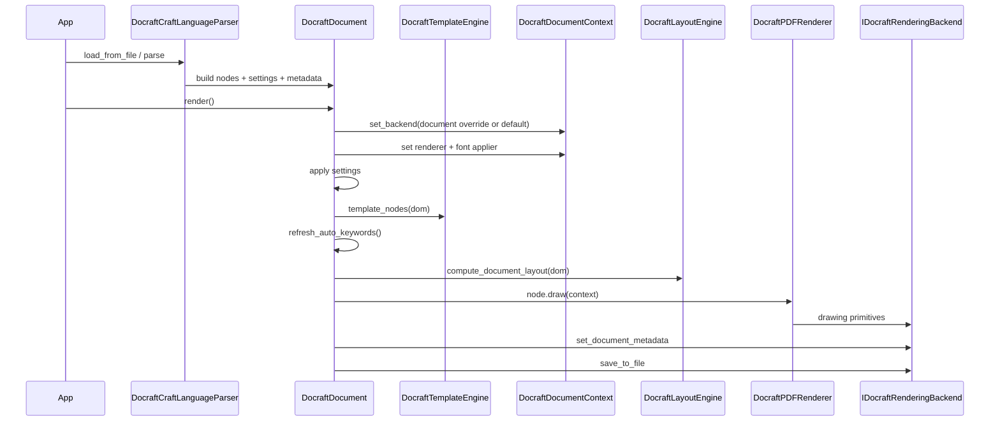

# Docraft Architecture (Contributor Guide)

This document explains how Docraft is built, which components compose the system, how they interact at runtime, and where contributors can extend behavior.

It is a high-level map. For component-level narrative details, use the files in `doc/contributors/components/`.

## 1. Architecture at a glance

Docraft is a layered document engine with a single main pipeline:

1. Parse `.craft` XML to a typed DOM.
2. Apply template expansion and data substitution.
3. Compute layout and pagination.
4. Render nodes via renderer and painters.
5. Delegate drawing to a backend implementation.
6. Write metadata and save output file.

## Layer view

## Runtime collaboration view

## 2. Composition of the system

Main subsystems and their roles:

- `craft` parser subsystem:
  - Parses XML tags into typed model nodes.
  - Owns the parser registry (`tag -> parser implementation`).
- `model` subsystem:
  - Defines document node types and shared geometry state.
  - Implements draw dispatch (`node->draw(context)`).
- `templating` subsystem:
  - Applies `${...}` variables.
  - Expands `Foreach` collections.
  - Hydrates tables/images from template data.
- `layout` subsystem:
  - Computes positions and sizes.
  - Assigns page ownership and handles pagination.
- `renderer` subsystem:
  - Converts node draw calls into painter calls.
  - Keeps backend-specific drawing out of model nodes.
- `backend` subsystem:
  - Declares backend contracts (`IDocraftRenderingBackend` and sub-interfaces).
  - Provides Haru PDF implementation.
- `generic` and `utils`:
  - Font resolution/application, base64, logging, keyword extraction, registries.

## 3. End-to-end data flow in detail

### 3.1 Parse phase

- Input: `.craft` XML string/file.
- Output: `DocraftDocument` containing:
  - root node list (`Header`, `Body`, `Footer` if present),
  - optional `DocraftSettings`,
  - parsed metadata.

Notable behavior:

- `Body` is required.
- Unknown element tags fail parsing when encountered in parsed subtrees.
- `Foreach` nodes store template child nodes for later expansion (templating stage).

### 3.2 Template phase

- Triggered inside `DocraftDocument::render()` if a template engine is set.
- Template engine mutates existing nodes (it does not create a separate document copy).
- Table-specific placeholders (`model`, `header`) are converted into concrete rows/titles.
- Image `data` placeholders can resolve raw in-memory image data.

### 3.3 Settings + metadata preparation

Before layout, document applies:

- page format and section ratios to context;
- external font registrations from `<Settings>`.

Metadata lifecycle:

- metadata comes from parser and/or API;
- optional auto-keyword extraction can merge generated keywords;
- final metadata is applied to backend just before save.

### 3.4 Layout and pagination

- `DocraftLayoutEngine` splits root nodes into header/body/footer.
- Builds section plan based on visibility and ratios.
- Runs handler chain for node-specific layout:
  - text wrapping/alignment,
  - list marker positioning,
  - table cell geometry,
  - generic container/shape handling.
- Body pagination handles:
  - explicit `NewPage` nodes,
  - overflow relocation to new page,
  - table splitting across pages.

### 3.5 Render phase

- Document iterates root nodes and calls `draw(context)`.
- Node draw methods delegate to renderer methods.
- Renderer delegates each concrete draw to a painter.
- Painters use backend interfaces for primitives.
- Backend writes final output.

## 4. Key design decisions

- Node model remains backend-agnostic.
- Rendering is split into renderer + painters for separation of concerns.
- Layout uses chain-of-responsibility handlers to keep node-specific rules isolated.
- Context caches sub-backend interfaces (`text_backend()`, `shape_backend()`, etc.) to reduce repeated casts.
- `DocraftDocument::render()` is the main orchestration point and intentionally centralizes pipeline sequencing.

## 5. Extension points

Primary extension points for contributors:

- Add a new XML node/tag:
  - parser + model + layout handler + renderer/painter.
- Add a new backend primitive:
  - extend interfaces + implement in backend + consume in painters.
- Add a new backend implementation:
  - implement `IDocraftRenderingBackend` (and required inherited contracts).
- Add new templating capability:
  - extend `DocraftTemplateEngine::template_node` + helper methods.

For detailed procedures, see component docs and backend integration guide.

## 6. Backend integration (internal and external)

Backend extensibility is based on interfaces, not on Haru-specific classes:

- Core contract: `IDocraftRenderingBackend`.
- Sub-contracts: text, line/shape, image, page management.

Current behavior:

- `DocraftDocument` exposes `set_backend(...)`.
- If a backend is set on document, `DocraftDocument::render()` uses it.
- If `nullptr` is set (or no override exists), render falls back to default Haru backend.
- `DocraftDocument::render()` currently wires `DocraftPDFRenderer` as renderer implementation.
- `DocraftDocumentContext` also exposes `set_backend(...)` for custom orchestration flows.

Detailed guide and examples are in:

- `doc/contributors/components/backend-integration.md`

## 7. Detailed component docs

- `doc/contributors/components/document-and-context.md`
- `doc/contributors/components/parser.md`
- `doc/contributors/components/model-and-dom.md`
- `doc/contributors/components/templating.md`
- `doc/contributors/components/layout-and-pagination.md`
- `doc/contributors/components/renderer-and-painters.md`
- `doc/contributors/components/backend.md`
- `doc/contributors/components/backend-integration.md`

## 8. Testing strategy map

Tests are grouped by subsystem in `docraft/test/`:

- `craft/`: parser behavior and schema-level validations.
- `templating/`: variable replacement and foreach expansion.
- `layout/`: wrapping, pagination, cursor behavior.
- `renderer/`: painter smoke tests and rendering contracts.
- `backend/`: backend-specific behavior.
- `model/`, `utils/`, `generic/`: unit-level contracts.

When introducing a feature, cover at least:

- parser acceptance/rejection path,
- layout effect,
- render/backend output-side behavior,
- edge cases (visibility, page ownership, overflow).
