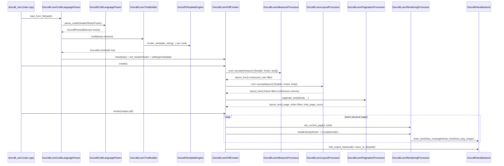

# Docraft "Loom" Pipeline — Craft to Rendering Flow

This document explains, end to end, how a `.craft` XML file becomes a PDF file on disk through
the **loom** pipeline — the pipeline-of-visitors architecture that is now the primary layout/render
engine (see `CLAUDE.md`). The legacy chain-of-responsibility pipeline is documented separately in
`architecture.md`; this file only covers `docraft/{include,src}/docraft/loom/` plus the
`docraft::craft` parsing layer that feeds it.

## 1. Architecture at a glance


Six stages, each with a single responsibility:

1. **Parse** `.craft` XML into a generic, engine-agnostic `DocraftParsedElement` tree (pugixml).
2. **Build** that tree into a typed `DocraftLoomNode` tree, resolving templating (`${...}`,
   `<Foreach>`) as each node is constructed.
3. **Measure** — a visitor pass computing each node's intrinsic size.
4. **Layout** — a visitor pass placing every node on one continuous, unbounded-height canvas.
5. **Paginate** — split that continuous canvas into discrete physical PDF pages.
6. **Render** — a visitor pass, run once per physical page, that paints only the nodes owned by
   that page via backend drawing interfaces, then saves the file.

## 2. Runtime collaboration view



## 3. Composition of the system

- **`docraft::craft`** (`docraft/include/docraft/craft/`, `docraft/src/docraft/craft/`) — generic,
  engine-agnostic XML parsing. Knows XML tags and common attributes; knows nothing about layout or
  rendering.
- **`docraft::craft::DocraftLoomCraftLanguageParser`** — the *only* piece that understands the
  top-level `<Document>` structure (`<Header>/<Body>/<Footer>/<Settings>/<Metadata>`) and drives
  both `docraft::craft` (Layer A) and `docraft::loom::craft::DocraftLoomTreeBuilder` (Layer B).
- **`docraft::loom::craft::DocraftLoomTreeBuilder`** — the *only* component that depends on both
  `docraft::craft` and `docraft::loom`; converts `DocraftParsedElement` → `DocraftLoomNode`,
  resolving templating per node as it builds.
- **`docraft::templating::DocraftTemplateEngine`** — `${variable}` substitution and
  `<Foreach model="...">` expansion via JSON data.
- **`docraft::loom::nodes`** — the node tree (`DocraftLoomNode` and subclasses) plus `LayoutBox`,
  the per-node accumulator that the four pipeline stages fill in, one field each.
- **`docraft::loom::pipeline`** — the four visitor processors (Measure, Layout, Pagination,
  Rendering), plus `DocraftLoomPipelineExecutor`, which runs a fresh Measure+Layout processor
  pair over one region (header/footer/body) at a time so per-traversal state never leaks between
  regions (§4.5), and `distribute_weighted_widths()`, the weight-resolution helper shared by
  Measure and Layout for HStack/Table column sizing.
- **`docraft::loom::DocraftLoomPdfCreator`** — top-level orchestrator; owns the single
  `DocraftHaruBackend` instance and sequences the six stages above.
- **`docraft::backend`** — capability-split backend interfaces (text/line/shape/image/page/output/
  font/metadata rendering). Loom does not have its own backend; it reuses the same
  `docraft::backend::pdf::DocraftHaruBackend` (libharu) used elsewhere in the codebase.

## 4. End-to-end data flow in detail

### 4.1 Entry point

The "`.craft` file path → PDF on disk" driver is `docraft_tool` (`docraft/src/docraft/main.cpp`).
`main()` in `main.cpp`:

1. Parses CLI args: `<file.craft> <output.pdf> [--data data.json]`.
2. Validates the input file exists.
3. Constructs `docraft::craft::DocraftLoomCraftLanguageParser`.
4. If `--data` was given, builds a `DocraftTemplateEngine` from the JSON via
   `add_template_variables_from_json()` (every field becomes a `${field}` variable, nested
   objects flattened to `${parent.child}`) and calls `parser.set_template_engine(engine)`.
5. `parser.load_from_file(path)` — parses the XML and builds a fully-wired
   `DocraftLoomPdfCreator` internally (§4.2–4.3).
6. `auto creator = parser.edit_creator();`
7. `creator->create();` then `creator->render(output_file);` (§4.4–4.6).

### 4.2 Parse phase — XML → `DocraftParsedElement` (engine-agnostic)

`docraft::craft::DocraftCraftLanguageParser` (pugixml-based) holds one `IDocraftParser` per
recognized tag (`docraft/include/docraft/craft/parser/*`: rectangle, circle, triangle, polygon,
line, text, image, page_number, blank_line, new_page, list, table, layout, paragraph, section,
foreach). Common attributes (`name`, `x`, `y`, `width`, `height`, `padding`, `margin`(+ per-edge),
`weight`, `z_index`, `visible`, `position`) are parsed generically once per element into
`DocraftCommonAttributes`; the tag-specific parser only fills the `std::any data` field. The result
is a `DocraftParsedElement` tree — tag name + common attributes + tag-specific data + children —
that has no notion of layout or rendering.

`<Table>` is special-cased: its row/cell structure is parsed entirely inside `DocraftTableParser`
rather than via generic child recursion.

### 4.3 Build phase — `DocraftParsedElement` → `DocraftLoomNode` (+ templating)

`DocraftLoomCraftLanguageParser::build_from_document()`:

1. Validates the root is `<Document>`.
2. For each of `<Header>/<Body>/<Footer>`, calls `craft_parser.parse_node(child)` (§4.2).
3. Requires `<Body>`; converts it via `DocraftLoomTreeBuilder::build(body_element)`.
4. Wraps the result in `DocraftLoomPdfCreator(body_node)`; builds/attaches header and footer the
   same way if present.
5. Applies `<Settings>` (`<Page size=".." orientation="..">` → `set_page_format`;
   `<SectionRatios>` → `set_section_ratios`; `<Fonts>` → `register_font` per family) and
   `<Metadata>` (`DocumentTitle`/`Author`/`Creator`/`Producer`/`Subject`/`Keywords` →
   `set_metadata`) if present.

`DocraftLoomTreeBuilder::build()` is the tag → node-type dispatch table:

| XML tag | Loom node type |
|---|---|
| `Rectangle` | `DocraftLoomRectangle` |
| `Circle` | `DocraftLoomCircle` |
| `Triangle` | `DocraftLoomTriangle` |
| `Polygon` | `DocraftLoomPolygon` |
| `Line` | `DocraftLoomLine` |
| `Text` | `DocraftLoomText` |
| `Title` | `DocraftLoomTitle` |
| `Subtitle` | `DocraftLoomSubtitle` |
| `PageNumber` | `DocraftLoomPageNumber` |
| `Image` | `DocraftLoomImage` |
| `Blank` | `DocraftLoomBlankLine` |
| `NewPage` | `DocraftLoomNewPage` |
| `List` / `UList` | `DocraftLoomList` |
| `Table` | `DocraftLoomTable` (+ `DocraftLoomTableCell`s) |
| `Layout` (`orientation="horizontal"\|"vertical"`) | `DocraftLoomHStack` / `DocraftLoomVStack` |
| `Paragraph` | `DocraftLoomParagraph` |
| `Header` / `Body` / `Footer` | `DocraftLoomVStack` (generic section container) |
| anything else | throws `DataFormatException` |

Notable behaviors:

- **`visible="false"`** on an element makes `build()` return `nullptr` — the subtree is never
  constructed.
- **`<Foreach model="${items}">`** is not a node type; `add_children()` detects it and expands it:
  resolves `model` through the template engine, parses it as JSON, and rebuilds the Foreach's
  child template once per array item (`current_foreach_item_` drives `${data("field")}` lookups
  inside that iteration). Without `model`, it repeats `n` times verbatim.
- **Templating is interleaved with tree construction**, not a separate pre-pass:
  `DocraftLoomText`'s text, `DocraftLoomImage`'s path, and `<Table model="..">`/`header="..">` are
  each resolved via `DocraftTemplateEngine::render_template_string()` at the moment that specific
  node is built.
- `apply_common_attributes<NodeT>()` conditionally applies `name`/`z_index`/`padding`/`margin`/
  `width`/`height`/`weight`/`position`/explicit `x`,`y` using C++20 `requires` clauses, so a node
  type only receives the setters it actually declares.

### 4.4 The node tree and `LayoutBox`

Every loom node derives from `DocraftLoomNode` (`docraft/include/docraft/loom/nodes/docraft_loom_node.h`),
which holds: children, `name`, `padding`, `margin`, `z_index`, `position_mode`
(`kBlock`/`kAbsolute`), `explicit_position`, and one `LayoutBox`:

```cpp
struct LayoutBox {
    Size measured_size;  // written by MeasureProcessor
    Rect frame;           // {position, size} — written by LayoutProcessor
    int  page_index;      // written by PaginationProcessor (-1 = render on every page)
};
```

Each pipeline stage writes exactly one of these three fields and later stages read what earlier
stages wrote — **pipeline order matters and stages must not be skipped**.

Node hierarchy: `DocraftLoomNode` → `DocraftLoomShape` (Circle/Triangle/Polygon/Line/Rectangle,
each with its own composed `DocraftLoomShapeStyle`, never a shared style base) →
`DocraftLoomLayoutContainer` (adds spacing/gap resolution) → `DocraftLoomVStack`/`DocraftLoomHStack`.
`DocraftLoomText` is a direct `DocraftLoomNode` subclass; `Title`/`Subtitle`/`PageNumber` extend
`DocraftLoomText`.

All four pipeline stages are visitors implementing `DocraftLoomIVisitor`
(`docraft/include/docraft/loom/interfaces/docraft_loom_visitor.h`) — one `visit(NodeType*)`
overload per node type — dispatched via double dispatch (`node->accept(visitor)` →
`visitor.visit(this)`). Adding a new node type means adding a `visit` overload to every processor.

### 4.5 Measure → Layout → Pagination (`DocraftLoomPdfCreator::create()`)

`create()` runs the three layout-computation stages, delegating the Measure+Layout half of each
region (header/footer/body) to a `DocraftLoomPipelineExecutor` constructed once per `create()`
call with the page-wide context (text backend, page width):

1. Computes `header_height`/`footer_height` from `page_height * ratio`, and the body's usable
   `body_top_y_`/`body_height_` from margins.
2. **Header** (if set): `executor.run(*header_, ..., assign_fixed_page_index=true)` — measures,
   lays out with the cursor reset to the header's top-left, then, because
   `assign_fixed_page_index` is `true`, stamps the whole subtree via
   `DocraftLoomPaginationProcessor::assign_page_index_recursive(header_, -1)` — header always
   renders, on every page.
3. **Footer** (if set): identical `executor.run(...)` call, cursor reset to the footer's top-left,
   also stamped `-1`.
4. **Body**: `executor.run(*root_node_, ..., cursor at (body_margins_.left, body_top_y_))` (default
   `assign_fixed_page_index=false`) — measures and lays out the whole body tree in one continuous,
   unbounded-height canvas; no page breaks exist yet.
5. Each `executor.run()` call builds its own fresh `DocraftLoomMeasureProcessor`/
   `DocraftLoomLayoutProcessor` pair rather than reusing one pair across regions: a region is a
   wholly separate traversal, and per-traversal state internal to those processors (e.g.
   `DocraftLoomMeasureProcessor`'s `inherited_wrap_width_`, `DocraftLoomLayoutProcessor`'s
   `inherited_width_`) must not leak from one region into the next — a fresh instance guarantees
   that structurally.
6. `DocraftLoomPaginationProcessor::paginate_body(body, body_top_y_, body_height_, page_backend)`
   walks the body's top-level children in order, tracking how much of the current page remains:
   - `DocraftLoomNewPage` forces a break.
   - A child that fits on the current page gets `page_index` stamped and the cursor advances.
   - A `DocraftLoomTable` that doesn't fit is split row-by-row (`try_split_table`) so as much as
     possible renders on the current page and the remainder continues on a new one, repeating
     across as many pages as needed.
   - Any other child that doesn't fit is moved whole to a fresh page.
   - Returns the total page count, physically creating pages via
     `IDocraftPageRenderingBackend::add_new_page()` as needed.

`DocraftLoomCursor` (defined alongside `DocraftLoomLayoutProcessor`) is the "pen position" used
**only** during the Layout stage — origin top-left, y grows downward. Pagination works directly on
the `frame` coordinates Layout already assigned; it does not use the cursor.

### 4.6 Render phase (`DocraftLoomPdfCreator::render()`)

For each physical page (`0 .. total_page_count_-1`):

1. `page_backend->go_to_page(page)` (or `go_to_first_page()` for page 0).
2. `rendering_processor.set_current_page(page, total_page_count_)`.
3. Header, body, footer each `accept(rendering_processor)`.

`DocraftLoomRenderingProcessor::should_render(node)` gates every draw call: a node paints only if
`page_index < 0` (always-render, e.g. header/footer) or `page_index == current_page_index_`.

The processor holds four narrow interface pointers pulled from
`IDocraftRenderingCapabilityProvider` — `IDocraftTextRenderingBackend`,
`IDocraftShapeRenderingBackend`, `IDocraftLineRenderingBackend`, `IDocraftImageRenderingBackend` —
and never depends on the concrete Haru type. Per node type it does roughly:

- **Text/Title/Subtitle**: draws wrapped or single-line text with alignment (including justified,
  via inter-word space redistribution), then strokes underline/strikeout outside the PDF text
  block. `PageNumber` recomputes its display string from `current_page_index_ + 1`, substitutes it
  (and, when boxed, its single wrapped line) into the node, then delegates to the same
  `visit(DocraftLoomText*)` path rather than duplicating its alignment/box-width handling — this
  is also what gives `PageNumber` underline/strikeout support.
- **Rectangle/VStack/HStack**: paints a background/border, then recurses into children.
- **Image**: dispatches on format (`kPng`/`kJpeg`/`kRaw`) to the matching backend call.
- **Line/Circle/Triangle/Polygon**: fills and/or strokes based on resolved style flags.
- **List**: draws each marker (box or glyph), then delegates to the item's text node.
- **Table**: draws default cell backgrounds, then outer border + row/column dividers (from cells'
  *actual resolved frames*), then content in two passes (body cells, then title cells, so title
  text paints over dividers beneath it).
- **BlankLine/NewPage**: draw nothing — pure spacers used by Measure/Pagination only.

There is **no loom-specific rendering backend** — loom fully reuses
`docraft::backend::pdf::DocraftHaruBackend` (libharu), the same backend stack used by the legacy
pipeline.

### 4.7 Output

After all pages are drawn, `render()` calls:

```cpp
backend_->edit_output_backend()->save_to_file(output_path.string());
```

This is the single point where bytes are written to disk (`DocraftHaruOutputBackend`, wrapping
libharu's save routine). Everything before it only mutates in-memory node state and the in-memory
libharu document object.

## 5. Key design decisions

- **Visitor pipeline over chain-of-responsibility handlers**: each stage is a single visitor pass
  over the whole tree, rather than per-node handler objects — adding a node type touches every
  processor's `visit` overload, not a big switch.
- **`LayoutBox` as a stage accumulator**: `measured_size` → `frame` → `page_index`, each written by
  exactly one stage, read by later stages — enforces pipeline order by construction.
- **Two-layer parsing**: `docraft::craft` (generic XML → `DocraftParsedElement`) has zero
  dependency on `docraft::loom`; only `DocraftLoomTreeBuilder` bridges the two, keeping the raw
  parser reusable if another engine is ever built on top of it.
- **Templating resolved during tree construction**, not as a separate AST pass — each node's
  text/path/table-model is substituted at the moment it's built.
- **Layout on an unbounded canvas, pagination as a separate pass**: Layout never thinks about page
  boundaries; Pagination re-flows the continuous result onto discrete pages afterward, including
  mid-table splits.
- **One shared backend instance** (`DocraftHaruBackend`) for both measurement (text metrics) and
  final drawing — no separate "measurement backend."
- **No loom-specific backend**: loom reuses the same capability-split backend interfaces
  (text/line/shape/image/page/output/font/metadata) as the legacy pipeline.

## 6. Extension points

- **New XML node/tag**: add a per-tag `IDocraftParser` under `docraft/{include,src}/docraft/craft/parser/`,
  a `DocraftLoomNode` subclass under `docraft/{include,src}/docraft/loom/nodes/`, a `build_*` case
  in `DocraftLoomTreeBuilder::build()`, and a `visit()` overload in `DocraftLoomIVisitor` plus all
  four processors.
- **New backend primitive**: extend the relevant `IDocraftXRenderingBackend` interface, implement
  it in `docraft::backend::pdf::DocraftHaru*Backend`, consume it from
  `DocraftLoomRenderingProcessor`.
- **New templating capability**: extend `DocraftTemplateEngine::render_template_string()` and the
  call sites in `DocraftLoomTreeBuilder`.

## 7. File path index

**Entry point**: `docraft/src/docraft/main.cpp` (`docraft_tool`).

**Orchestrator**: `docraft/include/docraft/loom/docraft_loom_pdf_creator.h`,
`docraft/src/docraft/loom/docraft_loom_pdf_creator.cc`.

**Parsing (generic)**: `docraft/include/docraft/craft/docraft_craft_language_parser.h`,
`docraft/include/docraft/craft/i_docraft_parser.h`,
`docraft/include/docraft/craft/docraft_craft_parsed_element.h`,
`docraft/include/docraft/craft/parser/*.h`.

**Parsing → loom bridge**: `docraft/include/docraft/craft/docraft_loom_craft_language_parser.h`,
`docraft/include/docraft/loom/craft/docraft_loom_tree_builder.h`.

**Templating**: `docraft/include/docraft/templating/docraft_template_engine.h`.

**Node tree**: `docraft/include/docraft/loom/nodes/docraft_loom_node.h`,
`docraft/include/docraft/loom/interfaces/docraft_loom_visitor.h`,
`docraft/include/docraft/loom/nodes/*.h` (all node types).

**Pipeline**: `docraft/include/docraft/loom/pipeline/docraft_loom_measure_processor.h`,
`docraft/include/docraft/loom/pipeline/docraft_loom_layout_processor.h` (also defines
`DocraftLoomCursor`), `docraft/include/docraft/loom/pipeline/docraft_loom_pagination_processor.h`,
`docraft/include/docraft/loom/pipeline/docraft_loom_rendering_processor.h`,
`docraft/include/docraft/loom/pipeline/docraft_loom_pipeline_executor.h` (runs Measure+Layout per
region, §4.5), `docraft/include/docraft/loom/pipeline/docraft_loom_weighted_distribution.h`
(shared HStack/Table column-weight resolution) — impls under matching `docraft/src/...` paths.

**Backend**: `docraft/include/docraft/backend/docraft_rendering_backend.h` and the per-capability
interfaces (`docraft_text_rendering_backend.h`, `docraft_shape_rendering_backend.h`,
`docraft_line_rendering_backend.h`, `docraft_image_rendering_backend.h`,
`docraft_page_rendering_backend.h`, `docraft_output_backend.h`); concrete implementation under
`docraft/include/docraft/backend/pdf/` and `docraft/src/docraft/backend/pdf/`.

**Worked example**: `docraft/test/docraft/craft/docraft_loom_craft_language_parser_test.cc` shows a
realistic `.craft` file (with `<Header>/<Body>/<Footer>`, `<Settings>`, `<Metadata>`) parsed end to
end.