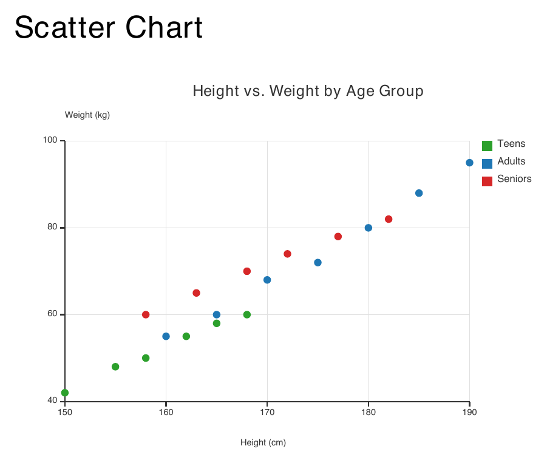
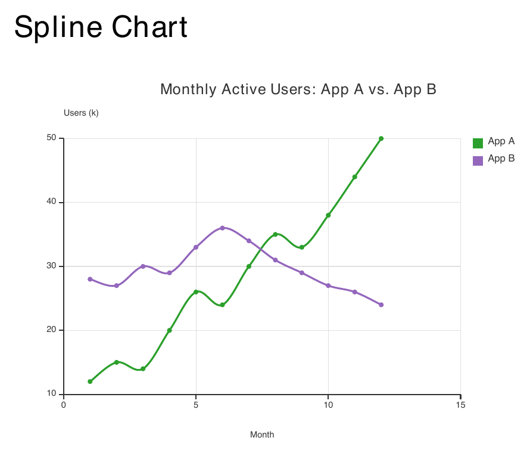
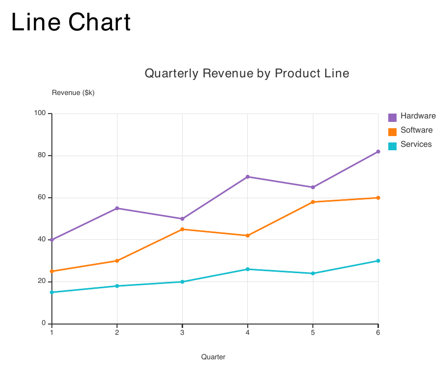
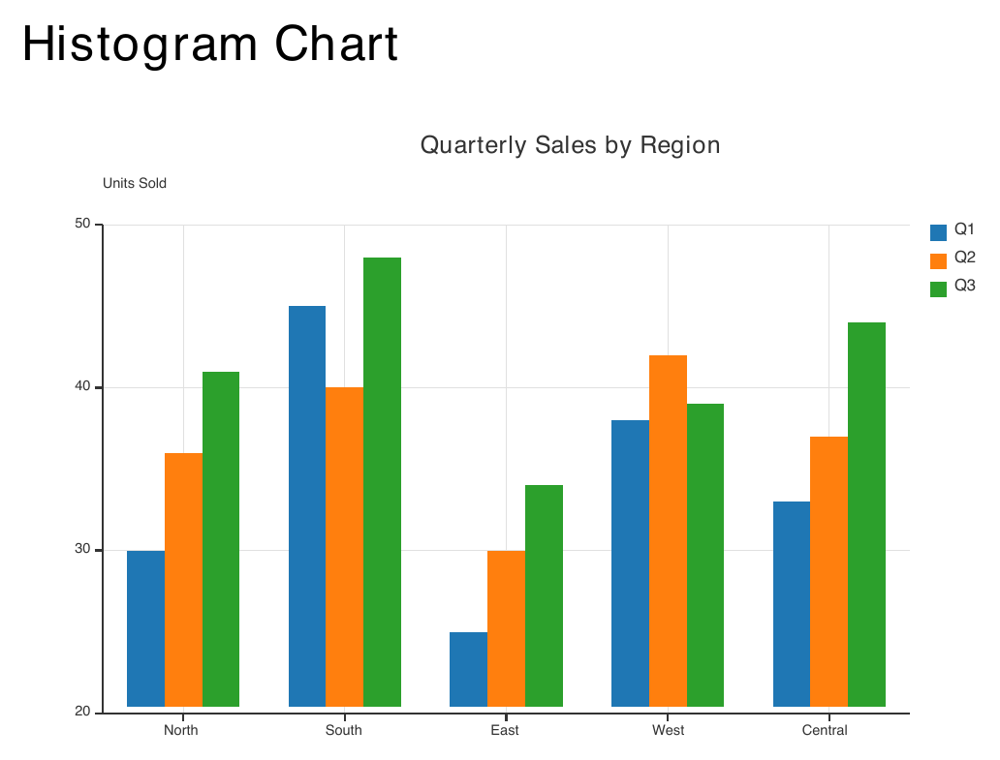
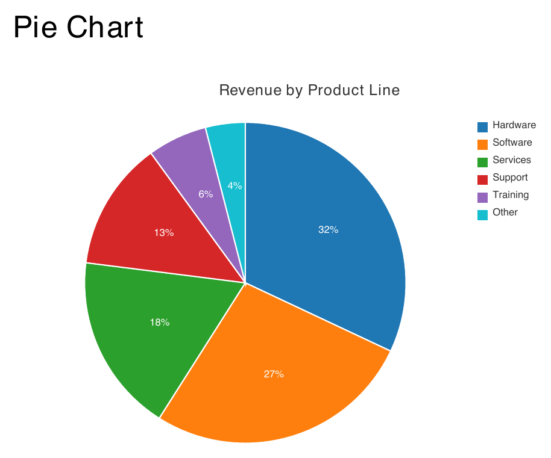
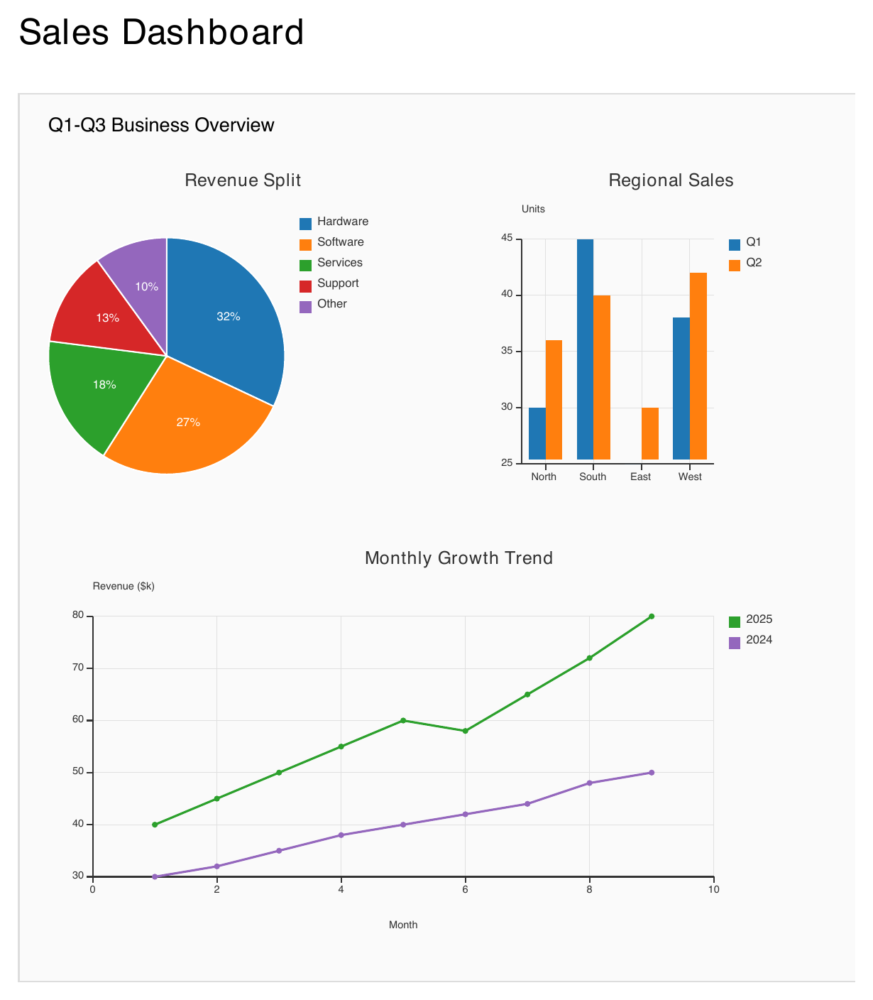
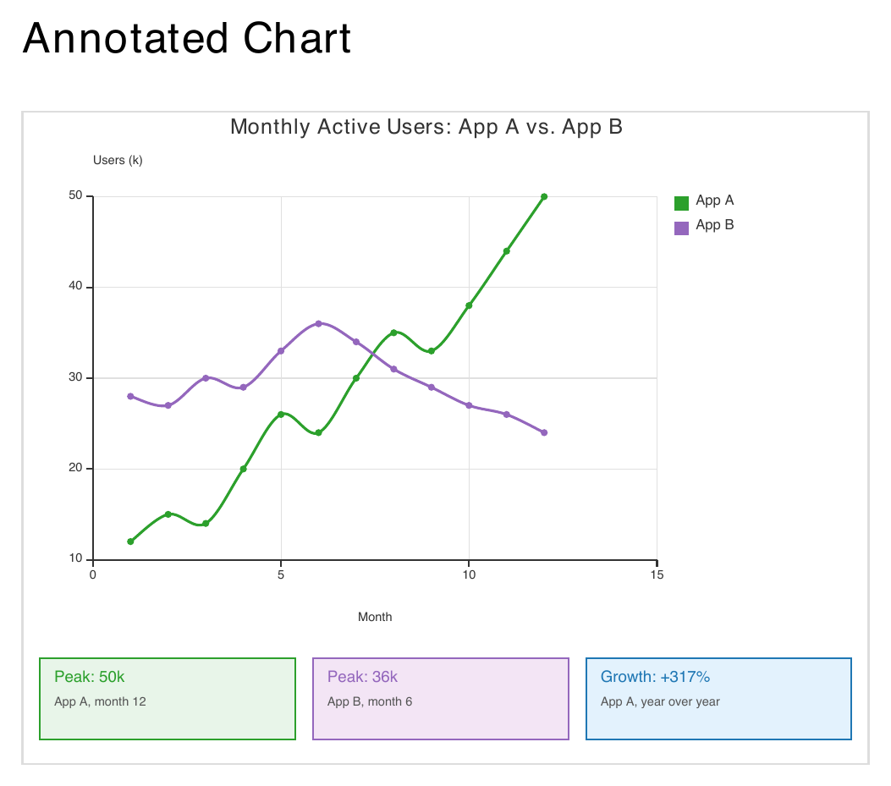

Charts
======

``<Chart>`` draws a data visualization -- scatter, spline, line, histogram, or pie --
directly on the page, without shelling out to an external plotting library. Internally
it's built on top of ``<Canvas>`` (see :doc:`shapes`): each chart style is a small
"plugin" that fills a canvas with ordinary primitive nodes (lines, circles, rectangles,
text), so nothing renderer-side needs to know about charts at all.

A chart always needs explicit ``width``/``height`` and a ``style``, and contains one or
more ``<Series>`` children supplying its data:

.. code-block:: xml

   <Chart style="scatter" width="300" height="200" title="My Chart"
          x_label="X" y_label="Y">
     <Series name="A" color="blue" model='[[1,2],[3,4]]' />
   </Chart>

``<Chart>`` Attributes
----------------------

In addition to the common node attributes (see :doc:`structure`), ``<Chart>`` accepts:

.. list-table::
   :header-rows: 1
   :widths: 20 15 65

   * - Attribute
     - Type
     - Description
   * - ``style``
     - string
     - **Required.** One of ``scatter``, ``spline``, ``line``, ``histogram``, ``pie``.
       An unrecognized value is a parse error.
   * - ``width``, ``height``
     - float
     - **Required.** Pixel size of the chart's canvas.
   * - ``title``
     - string
     - Optional chart title, centered above the plot.
   * - ``x_label``, ``y_label``
     - string
     - Optional axis labels. Ignored by ``pie`` (no axes).
   * - ``axis_position``
     - string
     - Where the axis lines cross: ``left`` (default), ``right``, ``top-left``,
       ``top-right``, ``bottom-left``, ``bottom-right``, or ``center``. Ignored by
       ``pie``.
   * - ``show_percentage``
     - bool
     - ``pie`` only: whether each slice draws its share of the total as a centered
       percentage label (default ``true``).

``<Series>`` Attributes
------------------------

Each ``<Chart>`` contains one or more ``<Series>`` elements supplying its data:

.. list-table::
   :header-rows: 1
   :widths: 20 15 65

   * - Attribute
     - Type
     - Description
   * - ``name``
     - string
     - Series label, shown in the legend (and, for ``pie``, used as a slice's label
       when the point itself doesn't carry one).
   * - ``color``
     - color
     - Series color. When omitted, a color is picked from a fixed palette, cycled by
       series index.
   * - ``model``
     - JSON
     - **Required.** The series' data points, in one of two shapes (see below).

A ``model`` is a JSON array whose entries are either:

- **Coordinate pairs** -- ``[x, y]`` or ``{"x": ..., "y": ...}`` -- for continuous data
  (scatter, spline, line), or
- **Labeled values** -- ``{"label": value}`` -- for categorical data (histogram, pie).
  Each entry becomes one point at ``x`` = its ordinal position in the array, ``y`` =
  the value, with the key kept as that point's category label (used for the X-axis
  tick in a histogram, or the slice label in a pie chart).

Data can also come from ``${...}`` template substitution, the same as any other
``model`` attribute (see :doc:`templating`).

Chart Styles
------------

Scatter
~~~~~~~

``style="scatter"`` plots one dot per data point, unconnected -- for showing the
relationship (or lack of one) between two continuous variables across one or more
series.

.. code-block:: xml

   <Chart style="scatter" width="480" height="300" title="Height vs. Weight by Age Group"
          x_label="Height (cm)" y_label="Weight (kg)">
     <Series name="Teens" color="#2CA02C" model='[[150,42],[155,48],[158,50],[162,55]]' />
     <Series name="Adults" color="#1F77B4" model='[[160,55],[165,60],[170,68],[175,72]]' />
     <Series name="Seniors" color="#D62728" model='[[158,60],[163,65],[168,70],[172,74]]' />
   </Chart>

Spline
~~~~~~

``style="spline"`` draws a smooth, interpolated curve through each series' points
(plus a marker dot at every point) -- for a trend that should read as continuous
rather than piecewise-linear. Two series with crossing trends (below) show the
interpolation staying smooth right through the crossover.

.. code-block:: xml

   <Chart style="spline" width="480" height="300" title="Monthly Active Users: App A vs. App B"
          x_label="Month" y_label="Users (k)">
     <Series name="App A" color="#2CA02C" model='[[1,12],[2,15],[3,14],[4,20],[5,26],[6,24],
       [7,30],[8,35],[9,33],[10,38],[11,44],[12,50]]' />
     <Series name="App B" color="#9467BD" model='[[1,28],[2,27],[3,30],[4,29],[5,33],[6,36],
       [7,34],[8,31],[9,29],[10,27],[11,26],[12,24]]' />
   </Chart>

Line
~~~~

``style="line"`` connects each series' points with straight segments (plus a marker
dot at every point) -- the same point model as ``spline``, differing only in how
points are connected.

.. code-block:: xml

   <Chart style="line" width="480" height="300" title="Quarterly Revenue by Product Line"
          x_label="Quarter" y_label="Revenue ($k)">
     <Series name="Hardware" color="#9467BD" model='[[1,40],[2,55],[3,50],[4,70],[5,65],[6,82]]' />
     <Series name="Software" color="#FF7F0E" model='[[1,25],[2,30],[3,45],[4,42],[5,58],[6,60]]' />
     <Series name="Services" color="#17BECF" model='[[1,15],[2,18],[3,20],[4,26],[5,24],[6,30]]' />
   </Chart>

Histogram
~~~~~~~~~

``style="histogram"`` draws grouped bars, one per data point, grouped side-by-side by
series at each shared category -- for comparing values across categories and, when
there's more than one series, across groups within each category. Use the
``{"label": value}`` model shape to get named categories on the X axis:

.. code-block:: xml

   <Chart style="histogram" width="560" height="320" title="Quarterly Sales by Region"
          y_label="Units Sold">
     <Series name="Q1" color="#1F77B4" model='[{"North":30},{"South":45},{"East":25},
       {"West":38},{"Central":33}]' />
     <Series name="Q2" color="#FF7F0E" model='[{"North":36},{"South":40},{"East":30},
       {"West":42},{"Central":37}]' />
     <Series name="Q3" color="#2CA02C" model='[{"North":41},{"South":48},{"East":34},
       {"West":39},{"Central":44}]' />
   </Chart>

.. note::

   The Y axis auto-zooms to the actual data range rather than always starting at
   zero (visible above: the axis starts at 20, not 0) -- so small differences
   between bars stay readable. A bar never sits flush against a non-zero baseline;
   a small gap always separates it from the axis line.

Pie
~~~

``style="pie"`` draws one slice per data point across every ``<Series>``, sized by its
share of the total. Unlike the other styles, a pie chart has no axes at all. Use the
``{"label": value}`` model shape for a labeled category breakdown:

.. code-block:: xml

   <Chart style="pie" width="480" height="300" title="Revenue by Product Line">
     <Series model='[{"Hardware":32},{"Software":27},{"Services":18},
       {"Support":13},{"Training":6},{"Other":4}]' />
   </Chart>

A series with a single point (one ``<Series>`` per slice) keeps that series' own
``color``; a series with multiple points (one ``<Series>`` holding a whole category
breakdown, as above) cycles each of its slices through the default palette instead,
since a single series color can't distinguish them. Points with a non-positive value
are skipped.

Combining Charts with Canvas
-----------------------------

Because ``<Chart>`` is just another node, it can be nested as a child of ``<Canvas>``
(see :doc:`shapes`) alongside ordinary shapes and text -- each positioned by its own
``x``/``y``, exactly like any other canvas child. This is how a multi-chart dashboard
or a chart annotated with custom callouts is built: there's no dedicated "dashboard"
or "annotation" node, just composition.

Multiple Charts on One Canvas
~~~~~~~~~~~~~~~~~~~~~~~~~~~~~~

A ``<Canvas>`` sized for a full widget grid, with three independent ``<Chart>``
children (a pie, a histogram, and a line chart) plus a heading and divider lines
drawn as ordinary shapes:

.. code-block:: xml

   <Canvas width="600" height="600" background_color="#FAFAFA"
           border_color="#DDDDDD" border_width="1">
     <Text x="20" y="16" font_size="13" bold="true">Q1-Q3 Business Overview</Text>
     <Line x1="20" y1="40" x2="580" y2="40" border_color="#DDDDDD" border_width="1"/>

     <Chart x="10" y="50" style="pie" width="290" height="230" title="Revenue Split">
       <Series model='[{"Hardware":32},{"Software":27},{"Services":18},
         {"Support":13},{"Other":10}]' />
     </Chart>
     <Chart x="300" y="50" style="histogram" width="290" height="230"
            title="Regional Sales" y_label="Units">
       <Series name="Q1" color="#1F77B4" model='[{"North":30},{"South":45},
         {"East":25},{"West":38}]' />
       <Series name="Q2" color="#FF7F0E" model='[{"North":36},{"South":40},
         {"East":30},{"West":42}]' />
     </Chart>

     <Line x1="20" y1="295" x2="580" y2="295" border_color="#DDDDDD" border_width="1"/>

     <Chart x="10" y="305" style="line" width="580" height="270" title="Monthly Growth Trend"
            x_label="Month" y_label="Revenue ($k)">
       <Series name="2025" color="#2CA02C" model='[[1,40],[2,45],[3,50],[4,55],
         [5,60],[6,58],[7,65],[8,72],[9,80]]' />
       <Series name="2024" color="#9467BD" model='[[1,30],[2,32],[3,35],[4,38],
         [5,40],[6,42],[7,44],[8,48],[9,50]]' />
     </Chart>
   </Canvas>

Each ``<Chart>`` lays out its own chrome (title, axes, legend) independently within
the bounding box its own ``width``/``height`` give it -- the parent ``<Canvas>``
doesn't know or care that its children happen to be charts.

Annotating a Chart with Custom Callouts
~~~~~~~~~~~~~~~~~~~~~~~~~~~~~~~~~~~~~~~~

A ``<Chart>`` has no built-in support for callouts or stat badges -- but wrapping it
in a ``<Canvas>`` and adding ordinary ``<Rectangle>``/``<Text>`` siblings below it
gets the same effect:

.. code-block:: xml

   <Canvas width="480" height="370" border_color="#DDDDDD" border_width="1">
     <Chart x="0" y="0" style="spline" width="480" height="300"
            title="Monthly Active Users: App A vs. App B"
            x_label="Month" y_label="Users (k)">
       <Series name="App A" color="#2CA02C" model='[[1,12],[2,15],[3,14],[4,20],
         [5,26],[6,24],[7,30],[8,35],[9,33],[10,38],[11,44],[12,50]]' />
       <Series name="App B" color="#9467BD" model='[[1,28],[2,27],[3,30],[4,29],
         [5,33],[6,36],[7,34],[8,31],[9,29],[10,27],[11,26],[12,24]]' />
     </Chart>

     <Rectangle x="10" y="310" width="145" height="46"
                background_color="#E8F5E9" border_color="#2CA02C" border_width="1"/>
     <Text x="18" y="317" font_size="9" bold="true" color="#2CA02C">Peak: 50k</Text>
     <Text x="18" y="332" font_size="7" color="#555555">App A, month 12</Text>

     <Rectangle x="320" y="310" width="150" height="46"
                background_color="#E3F2FD" border_color="#1F77B4" border_width="1"/>
     <Text x="328" y="317" font_size="9" bold="true" color="#1F77B4">Growth: +317%</Text>
     <Text x="328" y="332" font_size="7" color="#555555">App A, year over year</Text>
   </Canvas>

.. note::

   A ``<Chart>``'s own internal plot coordinates (where a given data point actually
   lands in pixels) aren't exposed back to the ``.craft`` file -- so a callout can be
   positioned relative to the chart's outer bounding box (as above), but not
   pixel-aligned to one specific data point without already knowing the chart's own
   axis-scaling.
