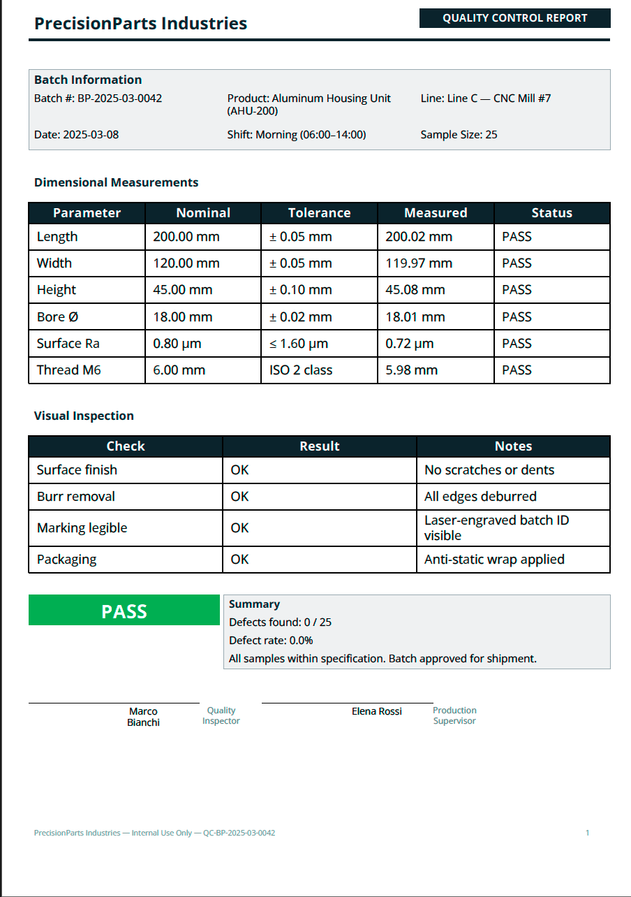

Industrial Quality Report
=========================

A production quality control report for manufacturing, with batch details,
measurement tables, pass/fail summary, and inspector sign-off.

Template — ``quality_report.craft``
------------------------------------

.. code-block:: xml

   <Document>
       <Settings page_size="A4" page_orientation="portrait"
                 header_ratio="0.08" body_ratio="0.84" footer_ratio="0.08"/>

       <Metadata>
           <Author>${company_name}</Author>
           <Subject>QC Report — Batch ${batch_number}</Subject>
       </Metadata>

       <Header margin_left="25" margin_right="25" margin_top="8">
           <Layout orientation="horizontal">
               <Text weight="0.67" font_size="16" style="bold"
                     color="#1B2631">${company_name}</Text>
               <Rectangle weight="0.33" padding="4"
                          background_color="#1B2631">
                   <Text font_size="10" style="bold" alignment="center"
                         color="white">QUALITY CONTROL REPORT</Text>
               </Rectangle>
           </Layout>
           <Line x1="0" y1="0" x2="545" y2="0"
                 border_color="#1B2631" border_width="1.5"/>
       </Header>

       <Body margin_left="25" margin_right="25">
           <!-- Batch Information -->
           <Rectangle background_color="#F2F3F4" padding="10"
                      border_color="#ABB2B9" border_width="0.5">
               <Text font_size="11" style="bold" color="#1B2631">
                   Batch Information
               </Text>
               <Layout orientation="horizontal">
                   <Text weight="0.33" font_size="10">
                       Batch #: ${batch_number}
                   </Text>
                   <Text weight="0.33" font_size="10">
                       Product: ${product_name}
                   </Text>
                   <Text weight="0.34" font_size="10">
                       Line: ${production_line}
                   </Text>
               </Layout>
               <Layout orientation="horizontal">
                   <Text weight="0.33" font_size="10">
                       Date: ${production_date}
                   </Text>
                   <Text weight="0.33" font_size="10">
                       Shift: ${shift}
                   </Text>
                   <Text weight="0.34" font_size="10">
                       Sample Size: ${sample_size}
                   </Text>
               </Layout>
           </Rectangle>
           <Blank/>

           <!-- Measurements Table -->
           <Text font_size="11" style="bold" color="#1B2631">
               Dimensional Measurements
           </Text>
           <Table model="${measurements}">
               <THead>
                   <HTitle style="bold" font_size="9"
                           background_color="#1B2631" color="white">
                       Parameter
                   </HTitle>
                   <HTitle style="bold" font_size="9"
                           background_color="#1B2631" color="white">
                       Nominal
                   </HTitle>
                   <HTitle style="bold" font_size="9"
                           background_color="#1B2631" color="white">
                       Tolerance
                   </HTitle>
                   <HTitle style="bold" font_size="9"
                           background_color="#1B2631" color="white">
                       Measured
                   </HTitle>
                   <HTitle style="bold" font_size="9"
                           background_color="#1B2631" color="white">
                       Status
                   </HTitle>
               </THead>
           </Table>
           <Blank/>

           <!-- Visual Inspection -->
           <Text font_size="11" style="bold" color="#1B2631">
               Visual Inspection
           </Text>
           <Table model="${visual_checks}">
               <THead>
                   <HTitle style="bold" font_size="9"
                           background_color="#1B2631" color="white">Check</HTitle>
                   <HTitle style="bold" font_size="9"
                           background_color="#1B2631" color="white">Result</HTitle>
                   <HTitle style="bold" font_size="9"
                           background_color="#1B2631" color="white">Notes</HTitle>
               </THead>
           </Table>
           <Blank/>

           <!-- Summary -->
           <Layout orientation="horizontal">
               <Rectangle weight="0.33" padding="10"
                          background_color="${result_color}">
                   <Text font_size="18" style="bold" alignment="center"
                         color="white">${overall_result}</Text>
               </Rectangle>
               <Rectangle weight="0.67" padding="10"
                          background_color="#F2F3F4"
                          border_color="#ABB2B9" border_width="0.5">
                   <Layout orientation="vertical">
                   <Text font_size="10" style="bold" color="#1B2631">Summary</Text>
                   <Text font_size="10">
                       Defects found: ${defect_count} / ${sample_size}
                   </Text>
                   <Text font_size="10">
                       Defect rate: ${defect_rate}
                   </Text>
                   <Text font_size="10">${summary_notes}</Text>
                   </Layout>
               </Rectangle>
           </Layout>
           <Blank/>
           <Blank/>

           <!-- Sign-off -->
           <Layout orientation="horizontal">
               <Rectangle weight="0.4" padding="5">
                   <Line x1="0" y1="0" x2="160" y2="0"
                         border_color="black" border_width="0.5"/>
                   <Text font_size="9" alignment="center">
                       ${inspector_name}
                   </Text>
                   <Text font_size="8" alignment="center" color="#7F8C8D">
                       Quality Inspector
                   </Text>
               </Rectangle>
               <Rectangle weight="0.4" padding="5">
                   <Line x1="0" y1="0" x2="160" y2="0"
                         border_color="black" border_width="0.5"/>
                   <Text font_size="9" alignment="center">
                       ${supervisor_name}
                   </Text>
                   <Text font_size="8" alignment="center" color="#7F8C8D">
                       Production Supervisor
                   </Text>
               </Rectangle>
               <Text weight="0.2"/>
           </Layout>
       </Body>

       <Footer margin_left="25" margin_right="25">
           <Layout orientation="horizontal">
               <Text weight="0.5" font_size="7" color="#95A5A6">
                   ${company_name} — Internal Use Only — QC-${batch_number}
               </Text>
               <PageNumber weight="0.5" font_size="7"
                           alignment="right" color="#95A5A6"/>
           </Layout>
       </Footer>
   </Document>

Data — ``quality_report.json``
-------------------------------

.. code-block:: json

   {
     "company_name": "PrecisionParts Industries",
     "batch_number": "BP-2025-03-0042",
     "product_name": "Aluminum Housing Unit (AHU-200)",
     "production_line": "Line C — CNC Mill #7",
     "production_date": "2025-03-08",
     "shift": "Morning (06:00–14:00)",
     "sample_size": "25",
     "measurements": [
       ["Length",       "200.00 mm", "± 0.05 mm", "200.02 mm", "PASS"],
       ["Width",        "120.00 mm", "± 0.05 mm", "119.97 mm", "PASS"],
       ["Height",       "45.00 mm",  "± 0.10 mm", "45.08 mm",  "PASS"],
       ["Bore Ø",       "18.00 mm",  "± 0.02 mm", "18.01 mm",  "PASS"],
       ["Surface Ra",   "0.80 µm",   "≤ 1.60 µm", "0.72 µm",   "PASS"],
       ["Thread M6",    "6.00 mm",   "ISO 2 class","5.98 mm",   "PASS"]
     ],
     "visual_checks": [
       ["Surface finish",  "OK",   "No scratches or dents"],
       ["Burr removal",    "OK",   "All edges deburred"],
       ["Marking legible", "OK",   "Laser-engraved batch ID visible"],
       ["Packaging",       "OK",   "Anti-static wrap applied"]
     ],
     "overall_result": "PASS",
     "result_color": "#27AE60",
     "defect_count": "0",
     "defect_rate": "0.0%",
     "summary_notes": "All samples within specification. Batch approved for shipment.",
     "inspector_name": "Marco Bianchi",
     "supervisor_name": "Elena Rossi"
   }

Usage
-----

.. code-block:: bash

   docraft_tool quality_report.craft output/quality_report.pdf -d quality_report.json

Output Example
--------------

