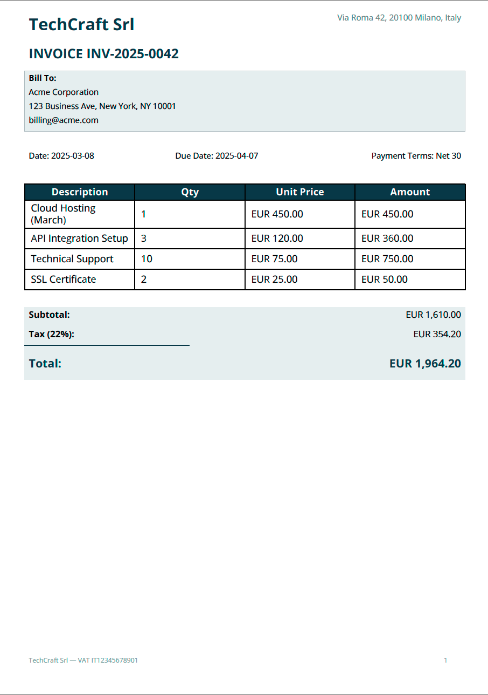

Invoice
=======

A professional invoice with company header, client details, itemized table,
and totals — all driven by JSON data.

Template — ``invoice.craft``
----------------------------

.. code-block:: xml

   <Document>
       <Settings page_size="A4" page_orientation="portrait"/>

       <Metadata>
           <Author>${company_name}</Author>
           <Subject>Invoice ${invoice_number}</Subject>
           <AutoKeywords enabled="true" max_keywords="10" language="en"/>
       </Metadata>

       <Header margin_left="30" margin_right="30" margin_top="10">
           <Layout orientation="horizontal">
               <Text weight="0.67" font_size="20" style="bold"
                     color="#2C3E50">${company_name}</Text>
               <Text weight="0.33" font_size="10" alignment="right"
                     color="#7F8C8D">${company_address}</Text>
           </Layout>
       </Header>

       <Body margin_left="30" margin_right="30">
           <!-- Invoice title -->
           <Text font_size="16" style="bold" color="#2C3E50">
               INVOICE ${invoice_number}
           </Text>
           <Blank/>

           <!-- Client info -->
           <Rectangle background_color="#ECF0F1" padding="10"
                      border_color="#BDC3C7" border_width="0.5">
               <Text font_size="10" style="bold">Bill To:</Text>
               <Text font_size="10">${client_name}</Text>
               <Text font_size="10">${client_address}</Text>
               <Text font_size="10">${client_email}</Text>
           </Rectangle>
           <Blank/>

           <!-- Date and payment terms -->
           <Layout orientation="horizontal">
               <Text weight="0.33" font_size="10">
                   Date: ${invoice_date}
               </Text>
               <Text weight="0.33" font_size="10">
                   Due Date: ${due_date}
               </Text>
               <Text weight="0.34" font_size="10" alignment="right">
                   Payment Terms: ${payment_terms}
               </Text>
           </Layout>
           <Blank/>

           <!-- Items table -->
           <Table model="${items}">
               <THead>
                   <HTitle style="bold" font_size="10"
                           background_color="#2C3E50" color="white">
                       Description
                   </HTitle>
                   <HTitle style="bold" font_size="10"
                           background_color="#2C3E50" color="white">
                       Qty
                   </HTitle>
                   <HTitle style="bold" font_size="10"
                           background_color="#2C3E50" color="white">
                       Unit Price
                   </HTitle>
                   <HTitle style="bold" font_size="10"
                           background_color="#2C3E50" color="white">
                       Amount
                   </HTitle>
               </THead>
           </Table>
           <Blank/>

           <!-- Totals -->
           <Rectangle background_color="#ECF0F1" padding="8">
               <Layout orientation="horizontal">
                   <Text weight="0.5" font_size="11" style="bold">Subtotal:</Text>
                   <Text weight="0.5" font_size="11"
                         alignment="right">${subtotal}</Text>
               </Layout>
               <Layout orientation="horizontal">
                   <Text weight="0.5" font_size="11" style="bold">Tax (${tax_rate}):</Text>
                   <Text weight="0.5" font_size="11"
                         alignment="right">${tax_amount}</Text>
               </Layout>
               <Line x1="0" y1="0" x2="200" y2="0"
                     border_color="#2C3E50" border_width="1"/>
               <Layout orientation="horizontal">
                   <Text weight="0.5" font_size="14" style="bold"
                         color="#2C3E50">Total:</Text>
                   <Text weight="0.5" font_size="14" style="bold"
                         alignment="right" color="#2C3E50">${total}</Text>
               </Layout>
           </Rectangle>
       </Body>

       <Footer margin_left="30" margin_right="30">
           <Layout orientation="horizontal">
               <Text weight="0.5" font_size="8" color="#95A5A6">
                   ${company_name} — VAT ${vat_number}
               </Text>
               <PageNumber weight="0.5" font_size="8" alignment="right"
                           color="#95A5A6"/>
           </Layout>
       </Footer>
   </Document>

Data — ``invoice.json``
-----------------------

.. code-block:: json

   {
     "company_name": "TechCraft Srl",
     "company_address": "Via Roma 42, 20100 Milano, Italy",
     "vat_number": "IT12345678901",
     "invoice_number": "INV-2025-0042",
     "invoice_date": "2025-03-08",
     "due_date": "2025-04-07",
     "payment_terms": "Net 30",
     "client_name": "Acme Corporation",
     "client_address": "123 Business Ave, New York, NY 10001",
     "client_email": "billing@acme.com",
     "items": [
       ["Cloud Hosting (March)",  "1",  "EUR 450.00", "EUR 450.00"],
       ["API Integration Setup",  "3",  "EUR 120.00", "EUR 360.00"],
       ["Technical Support",      "10", "EUR 75.00",  "EUR 750.00"],
       ["SSL Certificate",        "2",  "EUR 25.00",  "EUR 50.00"]
     ],
     "subtotal": "EUR 1,610.00",
     "tax_rate": "22%",
     "tax_amount": "EUR 354.20",
     "total": "EUR 1,964.20"
   }

Usage
-----

.. code-block:: bash

   docraft_tool invoice.craft output/invoice.pdf -d invoice.json

Output Example
--------------

