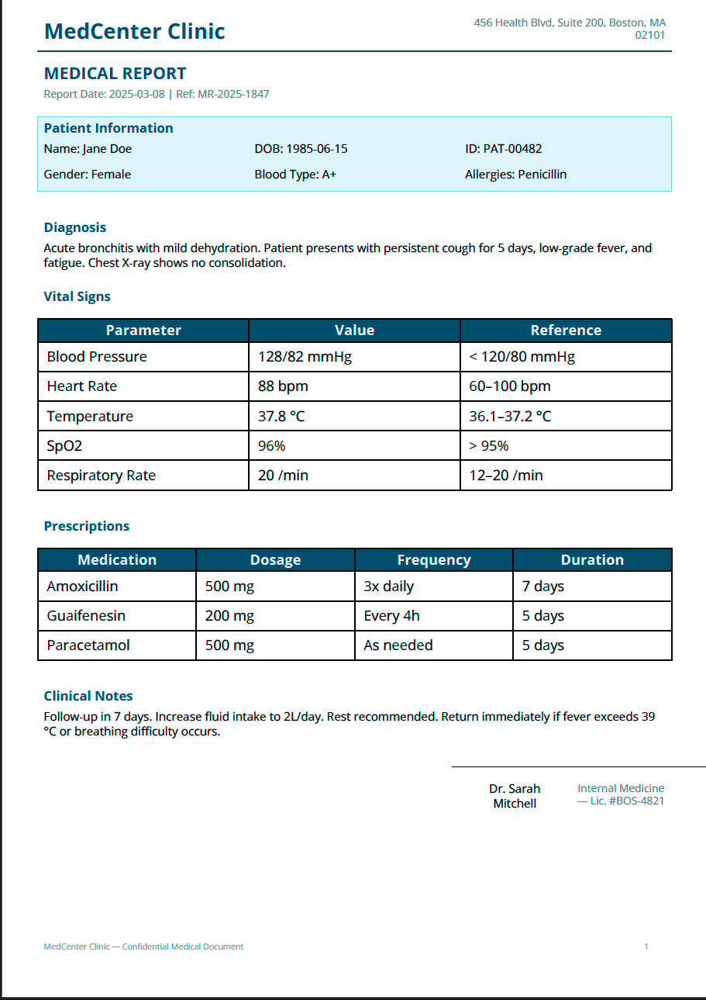

Medical Report
==============

A patient medical report with structured sections for clinic branding,
patient information, diagnosis, prescriptions, and physician signature.

Template — ``medical_report.craft``
------------------------------------

.. code-block:: xml

   <Document>
       <Settings page_size="A4" page_orientation="portrait"/>

       <Metadata>
           <Author>${clinic_name}</Author>
           <Subject>Medical Report — ${patient_name}</Subject>
       </Metadata>

       <Header margin_left="30" margin_right="30" margin_top="10">
           <Layout orientation="horizontal">
               <Text weight="0.67" font_size="18" style="bold"
                     color="#1A5276">${clinic_name}</Text>
               <Text weight="0.33" font_size="9" alignment="right"
                     color="#7F8C8D">${clinic_address}</Text>
           </Layout>
           <Line x1="0" y1="0" x2="535" y2="0"
                 border_color="#1A5276" border_width="1"/>
       </Header>

       <Body margin_left="30" margin_right="30">
           <Text font_size="14" style="bold" color="#1A5276">
               MEDICAL REPORT
           </Text>
           <Text font_size="9" color="#7F8C8D">
               Report Date: ${report_date}  |  Ref: ${report_ref}
           </Text>
           <Blank/>

           <!-- Patient Information -->
           <Rectangle background_color="#EBF5FB" padding="10"
                      border_color="#AED6F1" border_width="0.5">
               <Text font_size="11" style="bold" color="#1A5276">
                   Patient Information
               </Text>
               <Layout orientation="horizontal">
                   <Text weight="0.33" font_size="10">Name: ${patient_name}</Text>
                   <Text weight="0.33" font_size="10">DOB: ${patient_dob}</Text>
                   <Text weight="0.34" font_size="10">ID: ${patient_id}</Text>
               </Layout>
               <Layout orientation="horizontal">
                   <Text weight="0.33" font_size="10">Gender: ${patient_gender}</Text>
                   <Text weight="0.33" font_size="10">Blood Type: ${blood_type}</Text>
                   <Text weight="0.34" font_size="10">Allergies: ${allergies}</Text>
               </Layout>
           </Rectangle>
           <Blank/>

           <!-- Diagnosis -->
           <Text font_size="11" style="bold" color="#1A5276">Diagnosis</Text>
           <Text font_size="10">${diagnosis}</Text>
           <Blank/>

           <!-- Vital Signs -->
           <Text font_size="11" style="bold" color="#1A5276">Vital Signs</Text>
           <Table model="${vitals}">
               <THead>
                   <HTitle style="bold" font_size="9"
                           background_color="#1A5276" color="white">Parameter</HTitle>
                   <HTitle style="bold" font_size="9"
                           background_color="#1A5276" color="white">Value</HTitle>
                   <HTitle style="bold" font_size="9"
                           background_color="#1A5276" color="white">Reference</HTitle>
               </THead>
           </Table>
           <Blank/>

           <!-- Prescriptions -->
           <Text font_size="11" style="bold" color="#1A5276">Prescriptions</Text>
           <Table model="${prescriptions}">
               <THead>
                   <HTitle style="bold" font_size="9"
                           background_color="#1A5276" color="white">Medication</HTitle>
                   <HTitle style="bold" font_size="9"
                           background_color="#1A5276" color="white">Dosage</HTitle>
                   <HTitle style="bold" font_size="9"
                           background_color="#1A5276" color="white">Frequency</HTitle>
                   <HTitle style="bold" font_size="9"
                           background_color="#1A5276" color="white">Duration</HTitle>
               </THead>
           </Table>
           <Blank/>

           <!-- Notes -->
           <Text font_size="11" style="bold" color="#1A5276">Clinical Notes</Text>
           <Text font_size="10">${clinical_notes}</Text>
           <Blank/>
           <Blank/>

           <!-- Signature -->
           <Line x1="350" y1="0" x2="750" y2="0"
                 border_color="black" border_width="0.5"/>
           <Layout orientation="horizontal">
               <Text weight="0.67"/>
               <Rectangle weight="0.33" padding="5">

                   <Text font_size="10" alignment="center">${physician_name}</Text>
                   <Text font_size="9" alignment="center"
                         color="#7F8C8D">${physician_title}</Text>

               </Rectangle>

           </Layout>

       </Body>

       <Footer margin_left="30" margin_right="30">
           <Layout orientation="horizontal">
               <Text weight="0.5" font_size="7" color="#95A5A6">
                   ${clinic_name} — Confidential Medical Document
               </Text>
               <PageNumber weight="0.5" font_size="7"
                           alignment="right" color="#95A5A6"/>
           </Layout>
       </Footer>
   </Document>

Data — ``medical_report.json``
-------------------------------

.. code-block:: json

   {
     "clinic_name": "MedCenter Clinic",
     "clinic_address": "456 Health Blvd, Suite 200, Boston, MA 02101",
     "report_date": "2025-03-08",
     "report_ref": "MR-2025-1847",
     "patient_name": "Jane Doe",
     "patient_dob": "1985-06-15",
     "patient_id": "PAT-00482",
     "patient_gender": "Female",
     "blood_type": "A+",
     "allergies": "Penicillin",
     "diagnosis": "Acute bronchitis with mild dehydration. Patient presents with persistent cough for 5 days, low-grade fever, and fatigue. Chest X-ray shows no consolidation.",
     "vitals": [
       ["Blood Pressure",  "128/82 mmHg",  "< 120/80 mmHg"],
       ["Heart Rate",      "88 bpm",       "60–100 bpm"],
       ["Temperature",     "37.8 °C",      "36.1–37.2 °C"],
       ["SpO2",            "96%",          "> 95%"],
       ["Respiratory Rate","20 /min",      "12–20 /min"]
     ],
     "prescriptions": [
       ["Amoxicillin",     "500 mg", "3x daily",  "7 days"],
       ["Guaifenesin",     "200 mg", "Every 4h",  "5 days"],
       ["Paracetamol",     "500 mg", "As needed", "5 days"]
     ],
     "clinical_notes": "Follow-up in 7 days. Increase fluid intake to 2L/day. Rest recommended. Return immediately if fever exceeds 39 °C or breathing difficulty occurs.",
     "physician_name": "Dr. Sarah Mitchell",
     "physician_title": "Internal Medicine — Lic. #BOS-4821"
   }

Usage
-----

.. code-block:: bash

   docraft_tool medical_report.craft output/medical_report.pdf -d medical_report.json

Output Example
--------------

