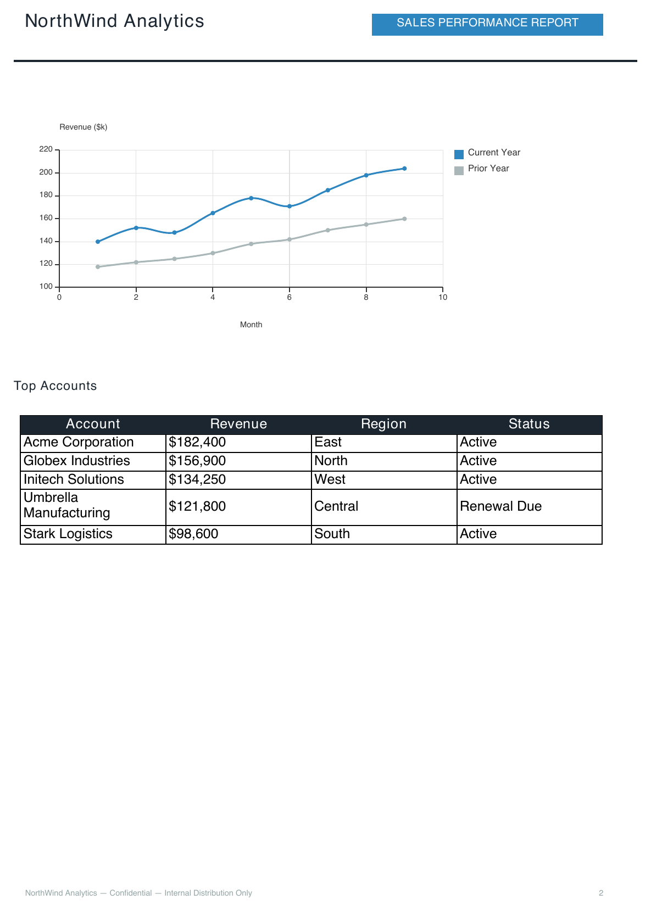

Sales Performance Report
=========================

A chart-driven business report: KPI stat cards, a pie + histogram dashboard on
one ``<Canvas>``, a year-over-year trend chart, and a top-accounts table — the
example to reach for when your document is built around data visualization
rather than tables of text (see :doc:`../craft_language/charts` for the full
``<Chart>`` reference).

Template — ``sales_report.craft``
------------------------------------

.. code-block:: xml

   <Document>
       <Settings>
           <Page size="A4" orientation="portrait"/>
           <SectionRatios header_ratio="0.08" body_ratio="0.84" footer_ratio="0.08"/>
       </Settings>

       <Metadata>
           <Author>${company_name}</Author>
           <Subject>Sales Performance Report — ${period}</Subject>
       </Metadata>

       <Header margin_left="25" margin_right="25" margin_top="8">
           <Layout orientation="horizontal">
               <Text weight="0.6" font_size="16" style="bold" color="#1B2631">${company_name}</Text>
               <Rectangle weight="0.4" padding="4" background_color="#2E86C1">
                   <Text font_size="10" style="bold" alignment="center" color="white">SALES PERFORMANCE REPORT</Text>
               </Rectangle>
           </Layout>
           <Line x1="0" y1="0" x2="545" y2="0" border_color="#1B2631" border_width="1.5"/>
       </Header>

       <Body margin_left="25" margin_right="25">
           <Text font_size="16" style="bold" color="#1B2631">${period}</Text>
           <Text font_size="9" color="#7F8C8D">Prepared by ${prepared_by} — ${report_date}</Text>
           <Blank/>

           <!-- KPI cards -->
           <Layout orientation="horizontal">
               <Rectangle weight="0.25" padding="8" background_color="#EBF5FB"
                          border_color="#3498DB" border_width="0.5">
                   <Text font_size="16" style="bold" color="#2E86C1">${total_revenue}</Text>
                   <Text font_size="8" color="#7F8C8D">Total Revenue</Text>
               </Rectangle>
               <Rectangle weight="0.25" padding="8" background_color="#EAFAF1"
                          border_color="#27AE60" border_width="0.5">
                   <Text font_size="16" style="bold" color="#27AE60">${yoy_growth}</Text>
                   <Text font_size="8" color="#7F8C8D">YoY Growth</Text>
               </Rectangle>
               <Rectangle weight="0.25" padding="8" background_color="#FEF9E7"
                          border_color="#F1C40F" border_width="0.5">
                   <Text font_size="16" style="bold" color="#B7950B">${new_customers}</Text>
                   <Text font_size="8" color="#7F8C8D">New Customers</Text>
               </Rectangle>
               <Rectangle weight="0.25" padding="8" background_color="#F4ECF7"
                          border_color="#9B59B6" border_width="0.5">
                   <Text font_size="16" style="bold" color="#8E44AD">${avg_deal_size}</Text>
                   <Text font_size="8" color="#7F8C8D">Avg Deal Size</Text>
               </Rectangle>
           </Layout>
           <Blank/>

           <!-- Revenue split + regional breakdown, two Charts on one Canvas -->
           <Text font_size="11" style="bold" color="#1B2631">Revenue &amp; Regional Breakdown</Text>
           <Canvas width="495" height="230">
               <Chart x="0" y="0" style="pie" width="240" height="220" title="By Product Line">
                   <Series model="${revenue_split}"/>
               </Chart>
               <Chart x="250" y="0" style="histogram" width="245" height="220"
                      title="By Region" y_label="$k">
                   <Series name="This Quarter" color="#2E86C1" model="${regional_sales}"/>
               </Chart>
           </Canvas>
           <Blank/>

           <!-- Monthly trend -->
           <Text font_size="11" style="bold" color="#1B2631">Monthly Revenue Trend</Text>
           <Chart style="spline" width="495" height="190" x_label="Month" y_label="Revenue ($k)">
               <Series name="Current Year" color="#2E86C1" model="${trend_current}"/>
               <Series name="Prior Year" color="#AAB7B8" model="${trend_prior}"/>
           </Chart>
           <Blank/>

           <!-- Top accounts -->
           <Text font_size="11" style="bold" color="#1B2631">Top Accounts</Text>
           <Table model="${top_accounts}">
               <THead>
                   <HTitle style="bold" font_size="9" background_color="#1B2631" color="white">Account</HTitle>
                   <HTitle style="bold" font_size="9" background_color="#1B2631" color="white">Revenue</HTitle>
                   <HTitle style="bold" font_size="9" background_color="#1B2631" color="white">Region</HTitle>
                   <HTitle style="bold" font_size="9" background_color="#1B2631" color="white">Status</HTitle>
               </THead>
           </Table>
       </Body>

       <Footer margin_left="25" margin_right="25">
           <Layout orientation="horizontal">
               <Text weight="0.5" font_size="7" color="#95A5A6">
                   ${company_name} — Confidential — Internal Distribution Only
               </Text>
               <PageNumber weight="0.5" font_size="7" alignment="right" color="#95A5A6"/>
           </Layout>
       </Footer>
   </Document>

.. note::

   ``<Chart>`` nests inside ``<Canvas>`` like any other node -- the "Revenue &
   Regional Breakdown" section above places two independent charts (pie +
   histogram) side by side on one canvas by giving each its own ``x``. See
   :ref:`Combining Charts with Canvas <craft_language/charts:Combining Charts with Canvas>`
   for more on this pattern.

Data — ``sales_report.json``
-------------------------------

.. code-block:: json

   {
     "company_name": "NorthWind Analytics",
     "period": "Q3 2025 Sales Performance",
     "prepared_by": "Sara Neri, VP Sales",
     "report_date": "2025-10-05",
     "total_revenue": "$1.84M",
     "yoy_growth": "+18.4%",
     "new_customers": "62",
     "avg_deal_size": "$14.2k",
     "revenue_split": [{"Hardware":32},{"Software":27},{"Services":18},
       {"Support":13},{"Other":10}],
     "regional_sales": [{"N":210},{"S":340},{"E":180},{"W":295},{"C":260}],
     "trend_current": [[1,140],[2,152],[3,148],[4,165],[5,178],[6,171],
       [7,185],[8,198],[9,204]],
     "trend_prior": [[1,118],[2,122],[3,125],[4,130],[5,138],[6,142],
       [7,150],[8,155],[9,160]],
     "top_accounts": [
       ["Acme Corporation",        "$182,400", "East",    "Active"],
       ["Globex Industries",       "$156,900", "North",   "Active"],
       ["Initech Solutions",       "$134,250", "West",    "Active"],
       ["Umbrella Manufacturing",  "$121,800", "Central", "Renewal Due"],
       ["Stark Logistics",         "$98,600",  "South",   "Active"]
     ]
   }

Usage
-----

.. code-block:: bash

   docraft_tool sales_report.craft output/sales_report.pdf --data sales_report.json

Output Example
--------------

KPI cards, the revenue/regional chart dashboard, and the start of the trend
chart fill page 1; the rest of the trend chart and the top-accounts table
carry onto page 2:

.. image:: ../_static/sales_report_page1.png
   :alt: Sales Performance Report Example Output — page 1
   :align: center
   :width: 550px

