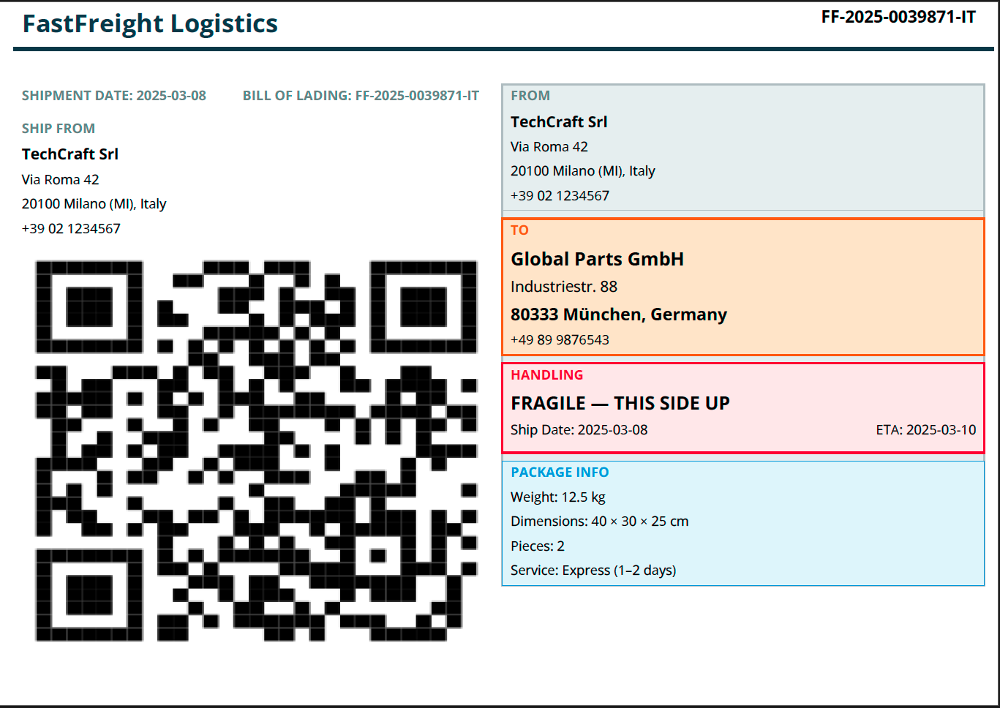

Shipping Label
==============

A compact shipping label for logistics and warehouse operations, with
sender/receiver details, barcode area, and package information.

Template — ``shipping_label.craft``
------------------------------------

.. code-block:: xml

   <Document>
       <Settings page_size="A5" page_orientation="landscape"/>

       <Body margin_left="8" margin_right="8" margin_top="6" margin_bottom="6">
           <!-- Header: Company + Tracking -->
           <Layout orientation="horizontal">
               <Text weight="0.52" font_size="15" style="bold"
                     color="#2C3E50">${carrier_name}
               </Text>
               <Text weight="0.48" font_size="10" style="bold"
                     alignment="right">${tracking_number}
               </Text>
           </Layout>
           <Line x1="0" y1="0" x2="585" y2="0"
                 border_color="#2C3E50" border_width="2"/>
           <Blank/>

           <Layout orientation="horizontal">
               <Rectangle weight="0.5" >
                   <Layout orientation="vertical">
                       <Layout orientation="horizontal">
                           <Text weight="0.45" font_size="8" style="bold" color="#7F8C8D">SHIPMENT DATE: ${ship_date}
                           </Text>
                           <Text weight="0.55"  font_size="8" style="bold" color="#7F8C8D">BILL OF LADING: ${tracking_number}
                           </Text>
                       </Layout>
                       <Text font_size="8" style="bold" color="#7F8C8D">SHIP FROM</Text>
                       <Text font_size="9" style="bold">${sender_name}</Text>
                       <Text font_size="8">${sender_address}</Text>
                       <Text font_size="8">${sender_city}</Text>
                       <Text font_size="8">${sender_phone}</Text>

                       <Image src="${qr_code}" width="290" height="250" alignment="center"/>
                   </Layout>
               </Rectangle>
               <Rectangle padding="5" weight="0.5" background_color="#ECF0F1" border_color="#BDC3C7">
                   <Layout orientation="vertical">
                       <!-- Row 1 -->
                       <Rectangle weight="0.5" padding="5"
                                  border_color="#BDC3C7" border_width="0.5">
                           <Text font_size="8" style="bold" color="#7F8C8D">FROM</Text>
                           <Text font_size="9" style="bold">${sender_name}</Text>
                           <Text font_size="8">${sender_address}</Text>
                           <Text font_size="8">${sender_city}</Text>
                           <Text font_size="8">${sender_phone}</Text>
                       </Rectangle>

                       <Rectangle weight="0.5" padding="5"
                                  background_color="#FDEBD0"
                                  border_color="#E67E22" border_width="1">
                           <Text font_size="8" style="bold" color="#E67E22">TO</Text>
                           <Text font_size="11" style="bold">${receiver_name}</Text>
                           <Text font_size="9">${receiver_address}</Text>
                           <Text font_size="10" style="bold">${receiver_city}</Text>
                           <Text font_size="8">${receiver_phone}</Text>
                       </Rectangle>

                       <Rectangle weight="0.60" padding="5"
                                  background_color="#FDEDEC"
                                  border_color="#E74C3C" border_width="1">
                           <Text font_size="8" style="bold" color="#E74C3C">HANDLING</Text>
                           <Text font_size="11" style="bold">${handling_instructions}</Text>
                           <Layout orientation="horizontal">
                               <Text weight="0.5" font_size="8">Ship Date: ${ship_date}</Text>
                               <Text weight="0.5" font_size="8" alignment="right">ETA: ${eta}</Text>
                           </Layout>
                       </Rectangle>

                       <Rectangle weight="0.40" padding="5"
                                  background_color="#EBF5FB"
                                  border_color="#3498DB" border_width="0.5">
                           <Text font_size="8" style="bold" color="#3498DB">PACKAGE INFO</Text>
                           <Text font_size="8">Weight: ${weight}</Text>
                           <Text font_size="8">Dimensions: ${dimensions}</Text>
                           <Text font_size="8">Pieces: ${pieces}</Text>
                           <Text font_size="8">Service: ${service_type}</Text>
                       </Rectangle>
                   </Layout>
               </Rectangle>
           </Layout>
       </Body>
   </Document>

Data — ``shipping_label.json``
-------------------------------

.. code-block:: json

   {
     "carrier_name": "FastFreight Logistics",
     "tracking_number": "FF-2025-0039871-IT",
     "sender_name": "TechCraft Srl",
     "sender_address": "Via Roma 42",
     "sender_city": "20100 Milano (MI), Italy",
     "sender_phone": "+39 02 1234567",
     "receiver_name": "Global Parts GmbH",
     "receiver_address": "Industriestr. 88",
     "receiver_city": "80333 München, Germany",
     "receiver_phone": "+49 89 9876543",
     "weight": "12.5 kg",
     "dimensions": "40 × 30 × 25 cm",
     "pieces": "2",
     "service_type": "Express (1–2 days)",
     "handling_instructions": "FRAGILE — THIS SIDE UP",
     "ship_date": "2025-03-08",
     "eta": "2025-03-10",
     "qr_code": "test.png" //this is an image in the same folder of the executable
   }

Usage
-----

.. code-block:: bash

   docraft_tool shipping_label.craft output/shipping_label.pdf -d shipping_label.json

Output Example
--------------

