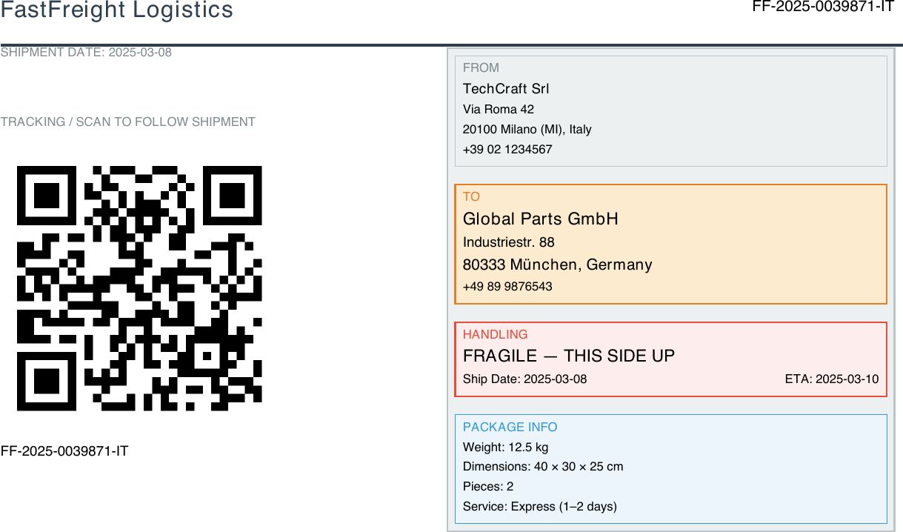

Shipping Label
==============

A compact shipping label for logistics and warehouse operations, with
sender/receiver details, a QR/barcode area, and package information. Sender
details appear once, in the ``FROM`` box on the right -- the left column is
reserved for the scan code, so nothing is duplicated.

Template — ``shipping_label.craft``
------------------------------------

.. code-block:: xml

   <Document>
       <Settings>
           <Page size="A5" orientation="landscape"/>
       </Settings>

       <Body margin_left="8" margin_right="8" margin_top="6" margin_bottom="6">
           <!-- Header: Company + Tracking -->
           <Layout orientation="horizontal">
               <Text weight="0.52" font_size="15" style="bold"
                     color="#2C3E50">${carrier_name}
               </Text>
               <Text weight="0.48" font_size="10" style="bold"
                     alignment="right">${tracking_number}
               </Text>
           </Layout>
           <Line x1="0" y1="0" x2="585" y2="0"
                 border_color="#2C3E50" border_width="2"/>
           <Blank/>

           <Layout orientation="horizontal">
               <Rectangle weight="0.5" >
                   <Layout orientation="vertical">
                       <Text font_size="8" style="bold" color="#7F8C8D">SHIPMENT DATE: ${ship_date}</Text>
                       <Blank/>
                       <Text font_size="8" style="bold" color="#7F8C8D">TRACKING / SCAN TO FOLLOW SHIPMENT</Text>
                       <Image src="${qr_code}" width="180" height="180"/>
                       <Text font_size="9" style="bold">${tracking_number}</Text>
                   </Layout>
               </Rectangle>
               <Rectangle padding="5" weight="0.5" background_color="#ECF0F1" border_color="#BDC3C7">
                   <Layout orientation="vertical">
                       <!-- Row 1 -->
                       <Rectangle weight="0.5" padding="5"
                                  border_color="#BDC3C7" border_width="0.5">
                           <Text font_size="8" style="bold" color="#7F8C8D">FROM</Text>
                           <Text font_size="9" style="bold">${sender_name}</Text>
                           <Text font_size="8">${sender_address}</Text>
                           <Text font_size="8">${sender_city}</Text>
                           <Text font_size="8">${sender_phone}</Text>
                       </Rectangle>

                       <Rectangle weight="0.5" padding="5"
                                  background_color="#FDEBD0"
                                  border_color="#E67E22" border_width="1">
                           <Text font_size="8" style="bold" color="#E67E22">TO</Text>
                           <Text font_size="11" style="bold">${receiver_name}</Text>
                           <Text font_size="9">${receiver_address}</Text>
                           <Text font_size="10" style="bold">${receiver_city}</Text>
                           <Text font_size="8">${receiver_phone}</Text>
                       </Rectangle>

                       <Rectangle weight="0.60" padding="5"
                                  background_color="#FDEDEC"
                                  border_color="#E74C3C" border_width="1">
                           <Text font_size="8" style="bold" color="#E74C3C">HANDLING</Text>
                           <Text font_size="11" style="bold">${handling_instructions}</Text>
                           <Layout orientation="horizontal">
                               <Text weight="0.5" font_size="8">Ship Date: ${ship_date}</Text>
                               <Text weight="0.5" font_size="8" alignment="right">ETA: ${eta}</Text>
                           </Layout>
                       </Rectangle>

                       <Rectangle weight="0.40" padding="5"
                                  background_color="#EBF5FB"
                                  border_color="#3498DB" border_width="0.5">
                           <Text font_size="8" style="bold" color="#3498DB">PACKAGE INFO</Text>
                           <Text font_size="8">Weight: ${weight}</Text>
                           <Text font_size="8">Dimensions: ${dimensions}</Text>
                           <Text font_size="8">Pieces: ${pieces}</Text>
                           <Text font_size="8">Service: ${service_type}</Text>
                       </Rectangle>
                   </Layout>
               </Rectangle>
           </Layout>
       </Body>
   </Document>

Data — ``shipping_label.json``
-------------------------------

``qr_code`` points at an image file expected next to the ``docraft_tool``
executable — any PNG works, including a real, scannable QR code generated with
a tool like `qrcode <https://pypi.org/project/qrcode/>`_ (JSON has no comment
syntax, so this can't be noted inline in the file itself):

.. code-block:: json

   {
     "carrier_name": "FastFreight Logistics",
     "tracking_number": "FF-2025-0039871-IT",
     "sender_name": "TechCraft Srl",
     "sender_address": "Via Roma 42",
     "sender_city": "20100 Milano (MI), Italy",
     "sender_phone": "+39 02 1234567",
     "receiver_name": "Global Parts GmbH",
     "receiver_address": "Industriestr. 88",
     "receiver_city": "80333 München, Germany",
     "receiver_phone": "+49 89 9876543",
     "weight": "12.5 kg",
     "dimensions": "40 × 30 × 25 cm",
     "pieces": "2",
     "service_type": "Express (1–2 days)",
     "handling_instructions": "FRAGILE — THIS SIDE UP",
     "ship_date": "2025-03-08",
     "eta": "2025-03-10",
     "qr_code": "qr.png"
   }

Usage
-----

.. code-block:: bash

   docraft_tool shipping_label.craft output/shipping_label.pdf --data shipping_label.json

Output Example
--------------

.. note::

   The right-hand column nests a vertical stack of four bordered/padded
   ``<Rectangle>`` boxes inside a horizontal ``<Layout>`` column. The current
   pagination pass moves that whole ``<Layout>`` onto a second PDF page rather
   than keeping it on page 1 with the header above it, even though the content
   itself fits well within one page's height -- the image above is composited
   from both pages to show the label as it's designed to read. If you hit the
   same "block moves to the next page even though it fits" pattern with your
   own nested Layouts, that's this same pagination behavior, not a mistake in
   your markup.

